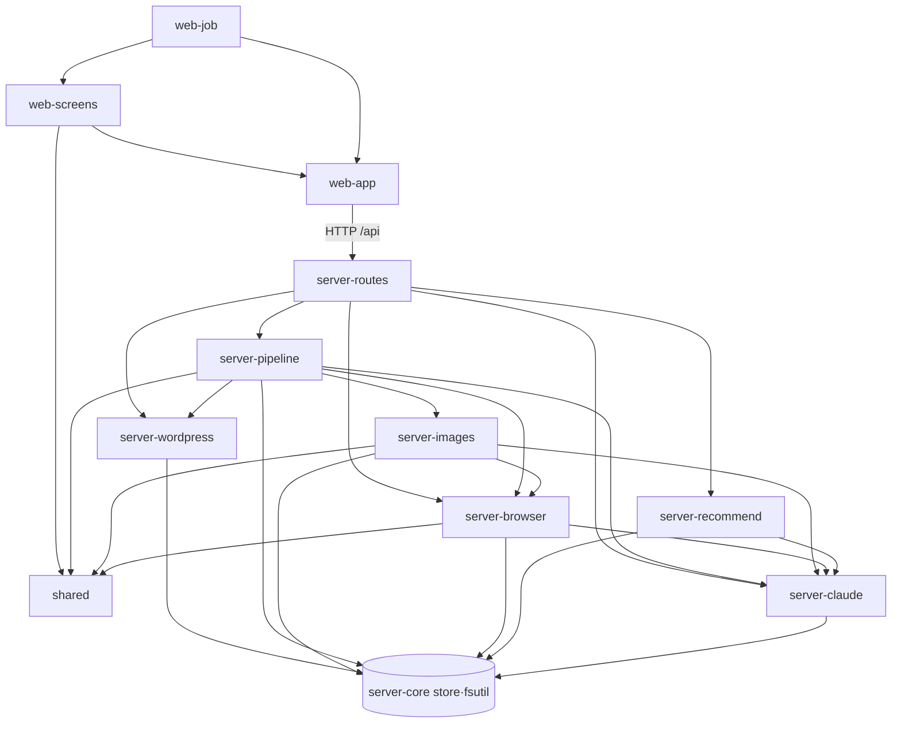

# 아키텍처

## 실행 단위
| 프로세스 | 진입점 | 포트/실행 | 역할 |
|---|---|---|---|
| API 서버 | `server/index.ts` → `server/app.ts` `createApp()` | `tsx watch server/index.ts`, `127.0.0.1:${PORT ?? 3001}` | REST API, 파이프라인 실행, 파일 저장 |
| 화면 | `index.html` → `src/main.tsx` | `vite` :5173, `/api`를 `127.0.0.1:3001`로 프록시 | React SPA |
| Claude 호출 | `server/claude.ts` `runClaude` | 호출마다 `claude -p` 자식 프로세스 (cwd = OS 임시 폴더) | 리서치·글 작성·이미지 기획·SVG·브라우저 조작·추천 |
| 앱 전용 크롬 | `server/browser/runner.ts` | Playwright `launchPersistentContext(data/chrome-profile)` | Claude in Chrome이 막는 블로그(네이버 외 OS 등)의 자동 조작 |
| 헤드리스 크롬 | `server/images/svg.ts` | Playwright `chromium.launch({channel:"chrome", headless:true})` | SVG → PNG |
| 평소 크롬 | `server/browser/userChrome.ts` | `osascript`로 탭 열고 JS 실행 (macOS) | 네이버 블로그 입력 |
| 로그인 창 | `server/browser/loginWindow.ts` | Chrome 실행 파일을 `--user-data-dir=data/chrome-profile`로 직접 실행 (한 번에 한 블로그) | 앱 전용 크롬에 블로그 로그인 |
| 워드프레스 | `server/wordpress.ts` | `fetch`로 사이트의 REST API 호출 (크롬 없음) | 임시저장·예약발행·자동발행 |
| 자동 테스트 | `vitest.config.ts` | `npm test` (임시 데이터 폴더) | 규칙·API 검사 확인 |

`npm run dev`가 서버와 화면을 함께 띄운다 (`blog-writer:package.json:7`).

## 레이어와 책임
- **화면** ([[_system/modules/web-app]], [[_system/modules/web-screens]], [[_system/modules/web-job]]): 입력, 진행 상황 폴링, 초안 편집·자동 저장, 복사.
- **API 라우터** ([[_system/modules/server-routes]] `server/app.ts` + `server/routes/*.ts`): 입력 검증(zod), 상태를 먼저 "진행 중"으로 바꾼 뒤(`markBusy`) 백그라운드 작업 시작, 202 응답.
- **파이프라인** ([[_system/modules/server-pipeline]] `server/pipeline.ts`): 작업 단위 실행·중복 방지·크롬 작업 직렬화.
- **기능 모듈**: 리서치/작성([[_system/modules/server-pipeline]]), 이미지([[_system/modules/server-images]]), 블로그 입력([[_system/modules/server-browser]] 크롬, [[_system/modules/server-wordpress]] API), 추천([[_system/modules/server-recommend]]).
- **외부 호출**: Claude CLI([[_system/modules/server-claude]]), 네이버 HTTP, 크롬.
- **저장**: `server/fsutil.ts`의 원자적 쓰기 + 쓰기 줄(`server/store.ts`가 작업·설정에 사용) → [[_system/data-storage]].
- **공용** ([[_system/modules/shared]]): 타입, 분량 계산, 붙여넣기 HTML, 이미지 오류 분류, 상태·블로그 이름. 서버와 화면이 같이 쓴다.

## 모듈 의존

## 대표 요청의 경로: "딥서칭 시작"
1. 화면 `NewJob.submit` → `POST /api/jobs` (`blog-writer:src/NewJob.tsx:81-96`).
2. 서버가 주제(2~300자)·링크(http(s), 최대 20개)·이미지 옵션을 검증하고, 이미지 옵션을 설정에 기억한 뒤 `createJob` → `void runDraft(id)` → 201 응답 (`blog-writer:server/routes/jobs.ts:43-72`).
3. `doDraft`: 규칙 읽기 → `deepResearch`(Claude + WebSearch/WebFetch) → 네이버 자동완성·함께 많이 찾는 수집 → `writePost`(Claude) → 분량 줄이기 → 태그 검증 → `makeImages` → `draft_ready` (`blog-writer:server/pipeline.ts:38-119`).
4. 각 단계는 `updateJob`/`log`로 `data/jobs/<id>.json`에 바로 기록한다.
5. 화면은 진행 중 작업이 있으면 1.5초마다 `GET /api/jobs`로 폴링한다 (`blog-writer:src/App.tsx:84-90`).
자세한 흐름은 [[writing/flows/초안 작성 플로우]].

## 비동기 / 백그라운드 작업
- 장시간 작업(초안·이미지·블로그 입력·추천)은 HTTP 응답 후 `void` 프로미스로 돈다. 진행 상황은 job 파일의 `status`·`logs`에 쓰고 화면이 폴링한다(작업 1.5초, 추천 2초, 로그인 창 3초, 사용량 15초/60초).
- 같은 작업은 동시에 한 번만 (`running` Set) → [[writing/business-rules/BR-WRT-011 작업 중복 실행과 진행 중 변경 금지]].
- 크롬을 쓰는 작업(네이버·티스토리 입력, Gemini/ChatGPT 이미지)은 전역 줄 `enqueueBrowser`(`serialQueue`)로 하나씩. 워드프레스 API 등록은 크롬을 쓰지 않아 이 줄을 거치지 않는다 → [[publishing/business-rules/BR-PUB-004 크롬 작업 직렬화]].
- 중지: 작업마다 AbortController를 두고 AsyncLocalStorage로 신호를 전달, `runClaude`가 자식 프로세스를 SIGTERM (`blog-writer:server/cancel.ts:1-36`, `blog-writer:server/claude.ts:91-96`).
- 서버 시작 시 진행 중으로 남은 작업·추천을 정리하고 90일 지난 사용량 기록을 지운다 (`blog-writer:server/index.ts:7-11`).

## 오류 처리 방식
- 라우터는 `wrap`으로 비동기 오류를 잡아 공통 핸들러로 보낸다. 4xx(본문 파싱 오류 등)는 "요청 형식이 올바르지 않습니다.", 500은 메시지를 그대로 (`blog-writer:server/routes/util.ts:6-10`, `blog-writer:server/app.ts:33-38`).
- 파이프라인 오류는 job의 `error`와 로그에 남기고, 초안이 있으면 `draft_ready`, 없으면 `failed`로 둔다.
- 이미지 하나의 실패는 그 이미지에만 기록하고 계속 진행한다 → [[image/business-rules/BR-IMG-007 이미지 실패 격리와 원인 분류]].
