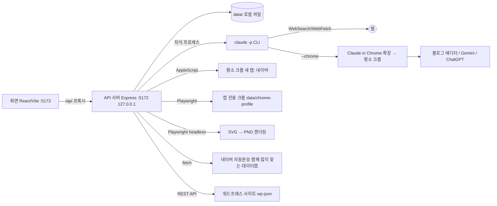

# blog-writer 개요

## 무엇을 하는가
한 사람이 자기 컴퓨터에서 쓰는 **블로그 초안 자동 작성 도구**다. 주제를 넣으면 Claude가 웹 검색으로 자료를 모으고(딥서칭), 사용자가 정한 "글쓰기 규칙"에 맞춰 공백 포함 3,000자 이내의 한국어 블로그 글을 쓰고, 썸네일·본문 이미지를 만든다. 사용자가 초안을 검토·수정한 뒤 버튼을 누르면 크롬에서 네이버 블로그·티스토리·워드프레스 글쓰기 화면에 입력하고 **임시저장까지만** 한다. 발행은 사용자가 직접 한다.

Claude는 API 키가 아니라 이 컴퓨터에 로그인된 Claude Code CLI(`claude -p`)를 자식 프로세스로 불러 쓴다. 그래서 API 요금 대신 Claude 구독 플랜 한도를 쓴다 (`blog-writer:README.md:1-13`).

## 주요 기능
- 주제 → 리서치 → 초안 → 이미지 → 검토 → 올릴 블로그 선택 → 네이버·티스토리는 크롬으로 임시저장, 워드프레스는 API로 임시저장·예약발행·자동발행 → [[writing/overview]], [[image/overview]], [[publishing/overview]]
- 분야를 넣으면 최근 뉴스·통계로 주제 후보 10~12개를 찾고 네이버 데이터랩 관심도로 순위를 매김 → [[topic/overview]]
- 글쓰기 규칙 편집 (다음 작업부터 적용) → [[writing/entities/글쓰기 규칙]]
- 단계별 Claude 모델 선택, 플랜 한도·토큰 사용량 보기 → [[usage/overview]]

## 구성

## 기술 스택
TypeScript(ESM), Express 5, zod 4, React 19, Vite 8, Playwright-core(설치된 Chrome 채널 사용), tsx(서버 실행), concurrently, vitest(자동 테스트) (`blog-writer:package.json:1-33`). DB 없이 `data/` 아래 JSON/JSONL 파일에 저장한다.

## 누가 쓰나
블로그 운영자 한 명. 로컬 전용이며 API는 127.0.0.1에만 열리고 localhost가 아닌 Host/Origin은 거부한다 ([[_system/api]] 공통 처리).

## 더 읽을 곳
- [[_system/architecture]], [[_system/api]], [[_system/data-storage]], [[_system/configuration]], [[_system/operations]], [[_system/known-issues]]
- 전체 목록은 [[index]], 용어는 [[glossary]]
