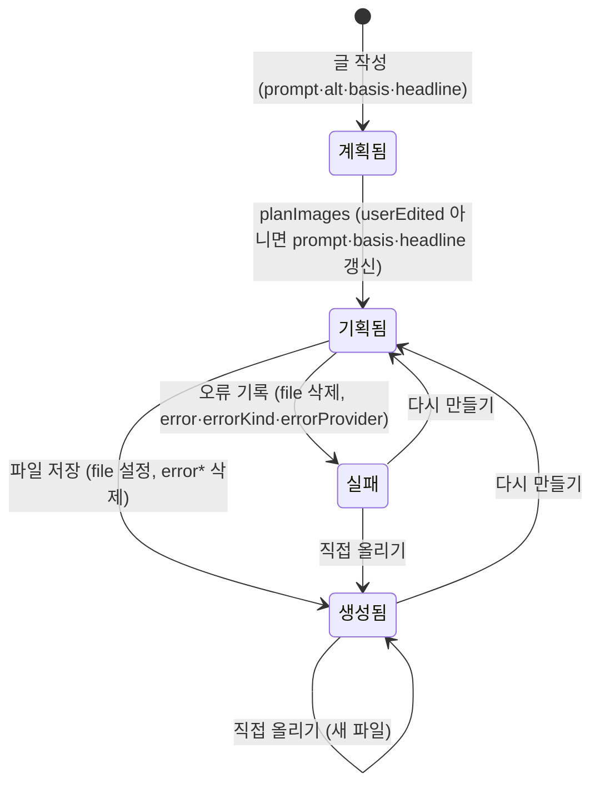

# ImageSpec (이미지)

## 의미
초안 안의 이미지 한 장(썸네일 `Post.thumbnail` 또는 본문 `type: "image"` 블록)의 설계와 결과. "무엇을 그릴지"와 "만든 파일/실패 원인"을 함께 담는다.

## 속성
| 속성 | 타입 | 의미 | 화면 표시 |
|---|---|---|---|
| `basis` | string? | 이 이미지가 그리는 본문 문장(그대로 인용) | "이 이미지가 그리는 본문: …" |
| `prompt` | string | 장면 설명. Claude는 한국어, Gemini/ChatGPT는 영어 | "이미지 설명 (다시 만들 때 사용)" |
| `headline` | string? (≤60자로 잘림) | 이미지 안에 넣을 한국어 문구. 비우면 글자 없음 | "이미지 안 문구", 썸네일 캡션 |
| `userEdited` | boolean? | 사용자가 설명·문구를 직접 고침 → 자동 기획에서 제외 | "직접 고친 설명과 문구라서…" |
| `alt` | string | 대체 텍스트 | "대체 텍스트" |
| `file` | string? | `data/images/<jobId>/` 아래 파일명 (`^(?!\.)[\w.-]+$`) | 미리보기 이미지 |
| `error` | string? | 실패 원문 메시지 | 첫 줄을 이미지 자리에 실패 이유로 |
| `errorKind` | ImageErrorKind? | 실패 원인 15종 | 원인별 안내 (메시지가 없으면 원인 제목) |
| `errorProvider` | ImageProvider? | 실패한 AI | "(Gemini)" 등 |

## 추가·삭제
- 본문 이미지 spec은 글에서 직접 추가(파일 없는 `{type:"image", alt, prompt}` 블록)·삭제(블록 제거 + 파일 삭제)할 수 있다. 썸네일 삭제는 `post.thumbnail` 제거. → [[image/business-rules/BR-IMG-015 본문 이미지 자리 추가와 이미지 삭제]]

## 상태와 전이

| 전이 | 조건 | 일어나는 곳 |
|---|---|---|
| → 생성됨 | 생성 성공 또는 업로드 | `blog-writer:server/images/index.ts:40-45`, `blog-writer:server/routes/images.ts:129-134` |
| → 실패 | 생성 중 오류 (중지는 제외) | `blog-writer:server/images/index.ts:46-49`, `:86-88` |

화면의 "만드는 중"은 `Job.generatingImages`(키 목록)로 표시한다. 한 장씩 동시에 다시 만들 수 있어 키를 더하고 빼며 관리한다 → [[image/business-rules/BR-IMG-014 한 장씩 다시 만들기 동시 실행]].

## 저장 위치
`Job.post.thumbnail`, `Job.post.blocks[n]`, 파일은 `data/images/<jobId>/` → [[_system/data-storage]]

## 적용되는 규칙
[[image/business-rules/BR-IMG-004 본문 기반 이미지 기획]], [[image/business-rules/BR-IMG-005 이미지 안 문구 길이]], [[image/business-rules/BR-IMG-006 직접 고친 이미지 보호]], [[image/business-rules/BR-IMG-007 이미지 실패 격리와 원인 분류]], [[image/business-rules/BR-IMG-008 이미지 결과는 서버 기록 우선]], [[image/business-rules/BR-IMG-013 이미지 API 우선과 만드는 방법 선택]], [[image/business-rules/BR-IMG-014 한 장씩 다시 만들기 동시 실행]], [[image/business-rules/BR-IMG-015 본문 이미지 자리 추가와 이미지 삭제]]
