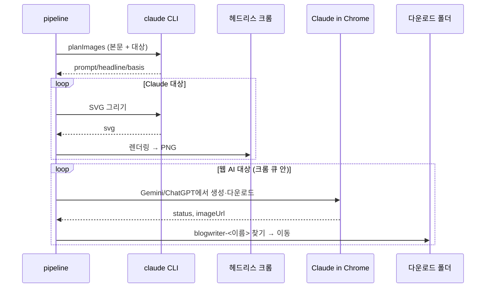

# 이미지 생성 플로우

## 목적
초안의 썸네일·본문 이미지를 본문 내용에 맞게 만들어 `data/images/<jobId>/`에 저장하고 초안에 기록한다.

## 단계
| # | 단계 | 위치 | 관련 규칙 |
|---|---|---|---|
| 1 | 범위에 맞는 대상 수집, 0개면 로그 후 끝 | `makeImages`, `collectTargets` | [[image/business-rules/BR-IMG-009 다시 만들기 범위]] |
| 2 | 상태 `generating_images`, 대상 키 기록 (화면이 그 이미지만 "만드는 중") | `makeImages` | |
| 3 | 로그 "이미지 생성 시작 (AI, 스타일)" | `makeImagesInner` | [[image/business-rules/BR-IMG-003 썸네일 AI와 스타일 결정]] |
| 4 | `userEdited` 아닌 대상만 AI·화풍 그룹별로 기획 호출 → prompt·basis·headline 갱신, 로그 "썸네일: 문구 “…”" | `planImages` | [[image/business-rules/BR-IMG-004 본문 기반 이미지 기획]], [[image/business-rules/BR-IMG-006 직접 고친 이미지 보호]] |
| 5 | 웹 AI를 쓰는 대상이 있으면 전역 크롬 큐에 넣어 실행, 아니면 바로 | `enqueueBrowser` | [[publishing/business-rules/BR-PUB-004 크롬 작업 직렬화]] |
| 6 | Claude 대상 먼저: SVG 그리기 → 검증 → 헤드리스 크롬 PNG | `generateSvgImage` | [[image/business-rules/BR-IMG-011 SVG 안전 검증과 크기]] |
| 7 | 웹 AI 대상: Claude in Chrome으로 Gemini/ChatGPT에서 생성 → 다운로드 폴더에서 회수 → 이동 | `generateWithWebAi` | [[_system/integrations/gemini-chatgpt-web]] |
| 8 | 한 장마다 결과(file) 또는 실패(error·kind·provider)를 바로 job에 기록, 로그 "이미지 생성 i/N" | `record` | [[image/business-rules/BR-IMG-007 이미지 실패 격리와 원인 분류]] |
| 9 | 실패 개수 로그, 진행 키 삭제 → 상태 `draft_ready` | `makeImages`, `doDraft`/`doImages` | |

## 시퀀스

## 실패 / 예외 경로
| 상황 | 결과 | 사용자에게 보이는 것 |
|---|---|---|
| 기획 실패 | 기존 설명으로 계속 | 로그 |
| 한 장 실패 | 그 이미지만 실패 기록 | 자리 표시 "⚠ 원인", 실패 안내 상자 → [[image/flows/이미지 다시 만들기 플로우]] |
| 확장 미설치/미연결 | 웹 AI 대상 각각 `extension` 실패 | 확장 상태 상자 |
| 중지 | 진행 중인 것만 멈춤, 만든 것 유지 | "이미지 생성을 중지했습니다." |

## 관련 엔티티
[[image/entities/ImageSpec]], [[image/entities/ImageOptions]]
