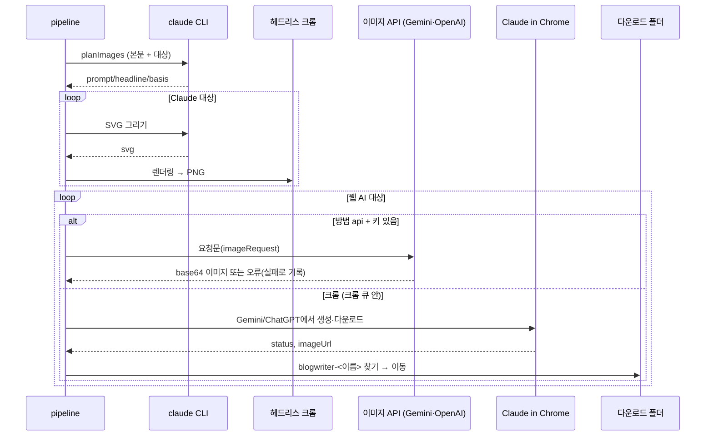

# 이미지 생성 플로우

## 목적
초안의 썸네일·본문 이미지를 본문 내용에 맞게 만들어 `data/images/<jobId>/`에 저장하고 초안에 기록한다.

## 단계
| # | 단계 | 위치 | 관련 규칙 |
|---|---|---|---|
| 0 | 실행 옵션 정하기: 글에 저장된 `imageOptions`(AI·화풍·방법, 썸네일·본문 따로). 한 장 다시 만들기면 그 종류의 AI·화풍·방법만 이번에 덮어씀 | `imagesStep` | [[image/business-rules/BR-IMG-003 썸네일 AI와 스타일 결정]], [[image/business-rules/BR-IMG-013 이미지 API 우선과 만드는 방법 선택]] |
| 1 | 범위에 맞는 대상 수집, 0개면 로그 후 끝 | `makeImages`, `collectTargets` | [[image/business-rules/BR-IMG-009 다시 만들기 범위]] |
| 2 | 상태 `generating_images`, 대상 키를 진행 목록에 더함 (화면이 그 이미지만 "만드는 중". 다른 이미지가 동시에 만들어지고 있을 수 있음) | `makeImages` | [[image/business-rules/BR-IMG-014 한 장씩 다시 만들기 동시 실행]] |
| 3 | 로그 "이미지 생성 시작 (AI, 스타일)" | `makeImagesInner` | [[image/business-rules/BR-IMG-003 썸네일 AI와 스타일 결정]] |
| 4 | `userEdited` 아닌 대상만 AI·화풍 그룹별로 기획 호출 → prompt·basis·headline 갱신, 로그 "썸네일: 문구 “…”" | `planImages` | [[image/business-rules/BR-IMG-004 본문 기반 이미지 기획]], [[image/business-rules/BR-IMG-006 직접 고친 이미지 보호]] |
| 5 | 실제로 크롬에서 만들 대상(Gemini·ChatGPT인데 `methodFor`가 `chrome`이거나 API 키가 없음)이 있으면 전역 크롬 큐에 넣어 실행, 아니면 바로 | `enqueueBrowser` | [[publishing/business-rules/BR-PUB-004 크롬 작업 직렬화]] |
| 6 | Claude 대상 먼저: SVG 그리기 → 검증 → 헤드리스 크롬 PNG | `generateSvgImage` | [[image/business-rules/BR-IMG-011 SVG 안전 검증과 크기]] |
| 7a | Gemini·ChatGPT 대상 + 그 종류의 방법(`methodFor`: 썸네일은 `thumbnailMethod ?? method`, 없으면 `api`)이 `api` + 키 있음: 이미지 API 호출 → base64 저장. 실패해도 크롬으로 넘기지 않음 | `generateWithApi` | [[image/business-rules/BR-IMG-013 이미지 API 우선과 만드는 방법 선택]], [[_system/integrations/image-api]] |
| 7b | 그 밖 Gemini·ChatGPT 대상: Claude in Chrome으로 사이트에서 생성 → 다운로드 폴더에서 회수(Claude가 `failed`로 보고해도 먼저 확인) → 이동 | `generateWithWebAi` | [[_system/integrations/gemini-chatgpt-web]] |
| 8 | 한 장마다 결과(file) 또는 실패(error·kind·provider)를 바로 job에 기록, 로그 "이미지 생성 i/N" | `record` | [[image/business-rules/BR-IMG-007 이미지 실패 격리와 원인 분류]] |
| 9 | 실패 개수 로그("… 각 이미지에서 이유를 확인하고 \"이미지 다시 생성\"으로 한 장씩 …"), 이번 진행 키만 삭제 → 상태 `draft_ready` (한 장씩 만들기는 다른 진행이 없을 때만) | `makeImages`, `doDraft`/`runImages`/`runImage` | |

## 시퀀스

## 실패 / 예외 경로
| 상황 | 결과 | 사용자에게 보이는 것 |
|---|---|---|
| 기획 실패 | 기존 설명으로 계속 | 로그 |
| 한 장 실패 | 그 이미지만 실패 기록 | 이미지 자리에 "⚠ 실패 이유 (AI)"와 안내, "이미지 다시 생성" → [[image/flows/이미지 다시 만들기 플로우]] |
| API 한도·잔액 부족 / 잘못된 키 / 거절 | `limit` / `api_error` / `refused` 실패, 크롬으로 넘기지 않음 | 이미지 자리의 실패 이유. "이미지 다시 생성"에서 방법을 크롬으로 골라 다시 만들 수 있음 |
| 웹 AI가 `failed` 보고 + 폴더·URL에도 파일 없음 | 사이트 오류 안내("문제가 발생했습니다" 등)면 `site_error`, 아니면 `ui_changed` 실패 (파일이 있으면 성공) | 이미지 자리의 실패 이유 |
| 확장 미설치/미연결 | 크롬에서 만들 대상 각각 `extension` 실패 | 이미지 자리의 실패 이유와 "설정 → Claude in Chrome" 안내 |
| 중지 | 진행 중인 것만 멈춤(한 장씩 동시에 만드는 것 모두), 만든 것 유지 | "이미지 생성을 중지했습니다." |

## 관련 엔티티
[[image/entities/ImageSpec]], [[image/entities/ImageOptions]]
