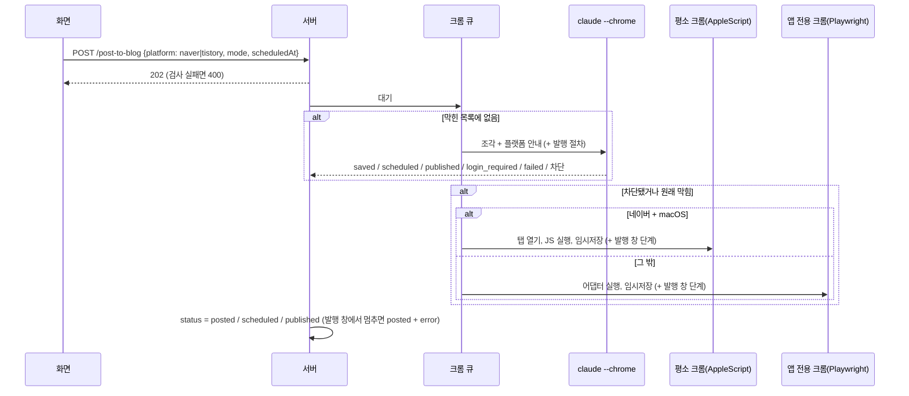
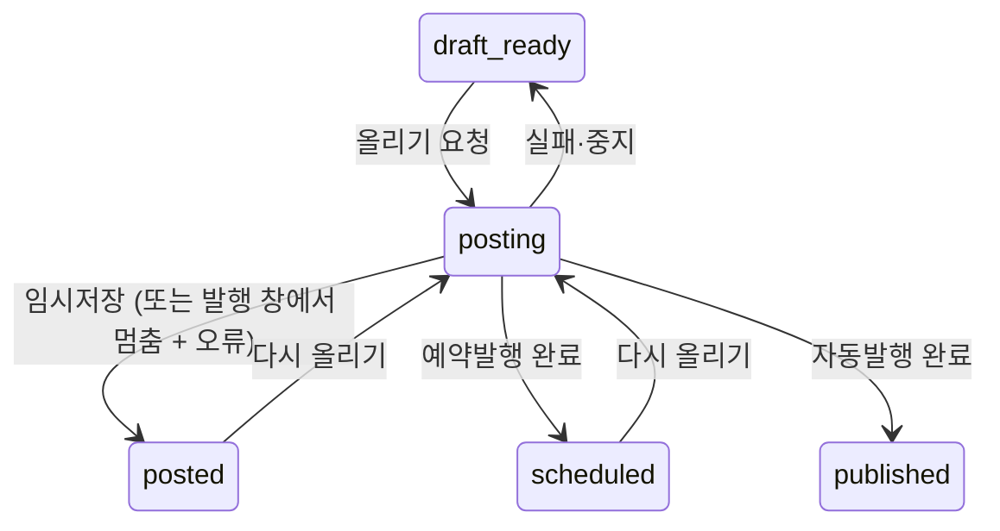

# 블로그 임시저장·발행 플로우 (네이버·티스토리)

> 파일 이름은 예전 이름("블로그 임시저장 플로우")을 그대로 둔다. 2026-10-09(65bfa3e)부터 예약발행·자동발행까지 다룬다. 발행 창 부분(8단계) 중 네이버 예약발행은 2026-10-09 실제 사이트에서 저장되는 것을 사용자가 확인했다. 티스토리와 네이버 자동발행은 모의 발행 창으로만 확인해 `confidence: medium`이다.

## 목적
검토한 초안을 고른 블로그(네이버·티스토리)의 글쓰기 화면에 넣고 **임시저장**한다. 사용자가 예약발행·자동발행을 골랐으면 이어서 블로그의 발행 창에서 예약하거나 바로 공개한다. 워드프레스는 이 흐름이 아니라 [[publishing/flows/워드프레스 API 등록 플로우]]를 탄다.

## 단계
| # | 단계 | 위치 | 관련 규칙 |
|---|---|---|---|
| 1 | 올릴 곳에서 블로그 선택 (기본 블로그 없음). 고르기 전에는 등록 버튼 없음 | `JobDetail` `destPicker`, `NextStep` | [[publishing/business-rules/BR-PUB-015 올릴 블로그는 글마다 선택]] |
| 2 | 올리는 방식 선택(`PublishModeFields`): 임시저장(기본) / 예약발행(공개 시각, 지금+1분 이후, 네이버는 10분 단위) / 자동발행. 예약·자동은 확인 창. 이미 이 블로그에 올린 글이면 "새 글이 하나 더 생깁니다" 안내 | `ChromeBlogNext` | [[publishing/business-rules/BR-PUB-014 워드프레스 등록 방식과 예약 시각]], [[publishing/business-rules/BR-PUB-019 다른 블로그에 올린 글 표시]] |
| 2a | 카테고리 선택(`CategoryField`): 블로그를 고르면 저장된 목록과 마지막으로 고른 카테고리를 불러옴. 목록이 비었거나 바뀌었으면 "목록 불러오기" → [[publishing/flows/카테고리 목록 불러오기 플로우]]. 안 고르면 블로그 기본 카테고리. 네이버 예약·자동이면 "네이버 주제는 글 내용을 보고 자동으로 고릅니다." 안내 | `NextStep` | [[publishing/business-rules/BR-PUB-020 카테고리 선택]] |
| 3 | 대기 중 편집 저장(`flush`) → `POST /post-to-blog {platform, mode, scheduledAt, category?}` | `JobDetail` | |
| 4 | 서버 검사: 초안 있음, 진행 중 아님, `platform` 있음, 그 블로그 ID 있음, 예약이면 시각(1분·네이버 10분), 확장 설치됨 → `markBusy(posting, platform)` → 202 | `routes/jobs.ts` | [[publishing/business-rules/BR-PUB-002 블로그 ID 형식]], [[publishing/business-rules/BR-PUB-001 발행하지 않고 임시저장까지만]] |
| 4a | 요청이 통과하면 고른 카테고리를 마지막 선택으로 저장(`saveLastCategory`) | `routes/jobs.ts` | [[publishing/business-rules/BR-PUB-020 카테고리 선택]] |
| 5 | `runPost`: 실행 중 표시. **네이버 예약·자동이면 크롬 큐에 들어가기 전에** Claude가 글 내용으로 주제를 고름(`pickNaverTopic`, 실패하면 주제 없이, 중지는 중지로) 뒤 전역 크롬 큐 대기 | `pipeline.ts` | [[publishing/business-rules/BR-PUB-004 크롬 작업 직렬화]] |
| 6 | 큐 차례: 중지 확인 → 고른 블로그로 `settingsFor` → 상태 posting(`postingTo` 기록), 로그 "<블로그 이름> 작성 시작 (<방식>[: 예약 시각][, 카테고리: X][, 주제: Y])" | `doPost` | |
| 7 | 경로 선택: 막힌 목록에 있으면 대체 경로, 없으면 Claude in Chrome | `doPost` | [[publishing/business-rules/BR-PUB-003 입력 경로 선택과 막힌 사이트 기억]] |
| 7a | Claude in Chrome: 본문을 HTML 조각·이미지 조각으로 나눔(네이버는 alt 이름 사본) → 플랫폼 안내·브라우저 규칙(+예약·자동이면 발행 절차)과 함께 Claude가 새 탭에서 글쓰기 화면 열기, 팝업 처리, 제목, 조각 순서대로 paste/file_upload, alt, 태그, 스크린샷 확인, 임시저장 | `blogPost.ts` | [[publishing/business-rules/BR-PUB-005 썸네일 위치]], [[publishing/business-rules/BR-PUB-006 태그 입력 위치]], [[publishing/business-rules/BR-PUB-007 소제목 위 빈 줄]], [[publishing/business-rules/BR-PUB-008 생성되지 않은 이미지 건너뜀]], [[publishing/business-rules/BR-PUB-009 네이버 이미지 파일 이름과 크기]] |
| 7b | 차단 감지 시: 막힌 목록에 기록 → 로그 → 대체 경로로 이어서 | `doPost` | |
| 7c | 대체(네이버+macOS): AppleScript로 평소 크롬 새 탭 → 에디터 대기(로그인이면 중단) → 이어쓰기 팝업 취소·남은 글 검사 → 제목 paste → 조각 paste·이미지 JPEG 업로드 → 소제목 서식 → 결과 검증 → 저장 확인 | `userChrome.ts` | [[publishing/business-rules/BR-PUB-010 이어쓰기 글이 있으면 중단]], [[publishing/business-rules/BR-PUB-011 입력 결과 검증]] |
| 7d | 대체(그 밖): 앱 전용 크롬 → 플랫폼 어댑터(로그인 화면이면 즉시 중단) → (티스토리) 카테고리 고르기 → 임시저장 → 창 유지 | `runner.ts`, `adapters.ts` | [[publishing/business-rules/BR-PUB-012 로그인 화면이면 멈춤]] |
| 8 | (예약발행·자동발행만) 임시저장 뒤 발행 창: 열기(여는 버튼이 든 상자는 발행 창으로 보지 않음) → [네이버만] **카테고리 고르기 → 주제 고르기**(둘 다 optional: 안 돼도 멈추지 않고 "확인 필요" + 화면 구조 로그, 주제는 팝업이 발행 창을 대체하므로 팝업에서 이름 고르고 "확인" 눌러 발행 창이 돌아올 때까지 한 단계) → [티스토리만 "공개" 고르기. 네이버는 공개 설정을 바꾸지 않음] → 예약(날짜·시·분 입력 후 다시 읽어 확인) 또는 현재 → 마지막 발행 버튼 → 글쓰기 화면을 벗어나는지 확인. 입력에 확인할 점이 있어도 진행하고 "확인 필요"로 로그에 남김. 단계가 멈추면 그 순간의 발행 창 구조를 진행 로그에 남김. Claude in Chrome은 같은 절차를 프롬프트로 | `publish.ts`, `userChrome.ts`, `adapters.ts` `publishIfAsked`, `blogPost.ts` | [[publishing/business-rules/BR-PUB-018 발행 창 단계와 안전장치]], [[publishing/business-rules/BR-PUB-021 네이버 주제 자동 선택]] |
| 9 | 결과 로그: 경로별 "임시저장 완료 (이미지 N개): …" / "평소 크롬에서 임시저장 완료 …" / "자동 조작으로 임시저장 완료", 문제마다 "확인 필요: …". 예약·자동이면 "<블로그 이름>에 <시각>(한국 시간)에 발행되도록 예약했습니다." / "<블로그 이름>에 발행했습니다." → 상태 `posted` / `scheduled` / `published` | `doPost` | |
| 10 | 화면: `posted` "<블로그>에 임시저장했습니다. 크롬 창에서 내용을 확인하고 직접 발행하거나, 아래에서 다시 올릴 수 있습니다…", `scheduled` "<블로그>에 발행 예약했습니다. 예약 시각은 진행 로그에서 볼 수 있습니다…", 버튼 "다시 올리기 (<방식>)". `published`는 "블로그 발행완료된 글입니다." (다시 올리는 버튼 없음) | `NextStep` | [[publishing/business-rules/BR-PUB-019 다른 블로그에 올린 글 표시]] |
| 11 | (필요하면) 진행 단계 아래 "글 상태"에서 초안 검토·블로그 임시저장 완료·블로그 발행완료로 직접 바꿈 → `PUT /status` | `StatusPicker`, `routes/jobs.ts` | [[publishing/business-rules/BR-PUB-013 발행 완료 표시]] |

로그에는 블로그 이름(`PLATFORM_LABEL`: "네이버 블로그"·"티스토리")이 들어간다 (`blog-writer:server/pipeline.ts:440`, `:412`). 2026-10-09 9a9c6df 전에는 코드 값(`naver`/`tistory`)이 그대로 나왔다.

## 시퀀스

## 상태

## 실패 / 예외 경로
| 상황 | 결과 | 사용자에게 보이는 것 |
|---|---|---|
| 블로그를 고르지 않은 요청 | 400 (시작 안 함) | "올릴 블로그를 선택하세요." |
| 예약 시각이 지금+1분 이내·형식 오류 | 400 | "예약 시각은 지금보다 1분 이상 뒤여야 합니다." / "예약 시각을 올바르게 입력하세요." |
| 네이버 예약 분이 10분 단위 아님 | 400 | "네이버 예약 시각은 10분 단위로 고를 수 있습니다." |
| 확장 미설치 | 400 (시작 안 함) | 설치 안내 |
| 확장 미연결 | 실패 → draft_ready | 오류 + 확장 상태 상자 |
| 로그인 필요 | 실패 → draft_ready | "로그인되어 있지 않습니다…". 네이버·티스토리를 골랐고 자동 조작 실패 로그가 있으면 그 블로그의 "로그인 창" 상자 |
| Claude가 failed | 실패 → draft_ready | "블로그 입력을 끝내지 못했습니다: …" |
| 임시저장 확인 실패(평소 크롬) | 실패 → draft_ready | "크롬에 열린 탭에서 직접 저장 버튼을 눌러 주세요." |
| 발행 창 단계에서 멈춤 / Claude가 발행 못 함 | `posted` + `job.error` | "임시저장은 했지만 발행 창의 "<단계>"에서 멈췄습니다: … 크롬에 열린 탭에서 직접 발행하세요." 등 → [[publishing/business-rules/BR-PUB-018 발행 창 단계와 안전장치]] |
| 발행 버튼은 눌렀지만 이동 확인 실패 | `posted` + `job.error` | "발행 버튼을 눌렀지만 발행됐는지 확인하지 못했습니다. 블로그에서 글이 공개·예약됐는지 직접 확인하세요." |
| 중지 (발행 버튼 누르기 전) | draft_ready | "블로그 작성을 중지했습니다. 크롬에 열린 탭에 일부만 들어갔을 수 있으니 확인하세요." (임시저장이 이미 됐어도 같음 → [[publishing/open-questions]] #13) |
| 타임아웃(Claude 45분) | 실패 | 결과 없이 종료 오류 |

## 관련 엔티티
[[publishing/entities/블로그 설정]], [[publishing/entities/막힌 사이트]], [[writing/entities/Post]], [[writing/entities/Job]]

## 관련 모듈
[[_system/modules/server-routes]], [[_system/modules/web-job]], [[_system/modules/server-browser]], [[_system/modules/server-pipeline]]

## 변경 이력
| 날짜 | 변경 | 근거 |
|---|---|---|
| 2026-10-09 | 임시저장만 하던 흐름 → 방식 선택(임시저장·예약발행·자동발행)과 발행 창 단계(8) 추가. `mode`가 `draft`가 아니면 400이던 경로 삭제. 결과 상태 `posted`만 → `posted`/`scheduled`/`published`. 화면 버튼 "다시 임시저장"·"발행 완료로 표시"·"초안 완료로 되돌리기" → "다시 올리기 (<방식>)"와 "글 상태" 한 줄 | 커밋 65bfa3e |
| 2026-10-09 | 발행 창 단계 수정: 팝업 찾는 방법(여는 버튼이 든 상자 제외), 네이버는 공개 설정 안 바꿈, 입력에 확인할 점이 있어도 발행(로그에 "확인 필요"), 멈추면 발행 창 구조를 로그에 남김, 로그에 블로그 이름 | 커밋 9a9c6df, `blog-writer:server/browser/publish.ts:97-119` |
| 2026-10-09 | 카테고리 선택(화면 → 요청 `category` → 마지막 선택 저장 → 네이버는 발행 창 optional 단계, 티스토리는 임시저장 전), 네이버 주제 자동 선택(크롬 큐 전에 Claude 호출) 단계 추가. 카테고리 목록은 별도 플로우 | 커밋 b7ced30 |
