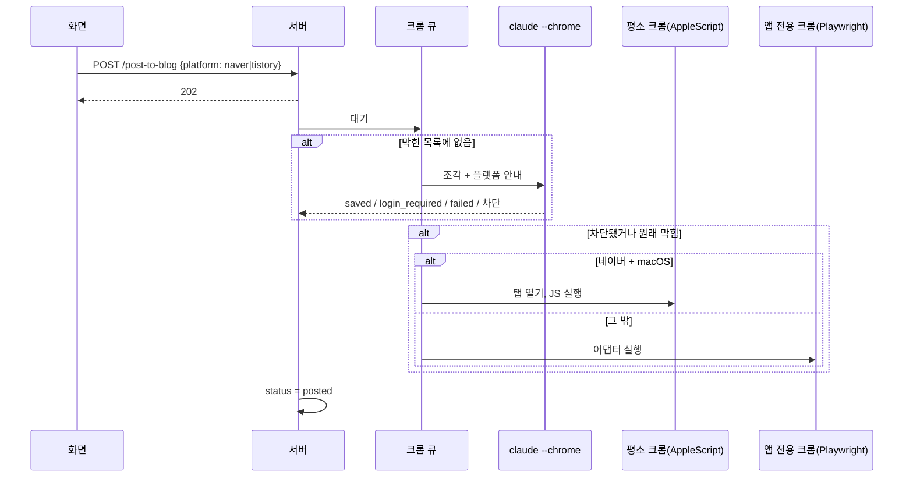

# 블로그 임시저장 플로우

## 목적
검토한 초안을 고른 블로그(네이버·티스토리)의 글쓰기 화면에 넣고 임시저장한다. 발행은 사용자가 한다. 워드프레스는 이 흐름이 아니라 [[publishing/flows/워드프레스 API 등록 플로우]]를 탄다.

## 단계
| # | 단계 | 위치 | 관련 규칙 |
|---|---|---|---|
| 1 | 올릴 곳에서 블로그 선택 (기본 블로그 없음). 고르기 전에는 등록 버튼 없음 | `JobDetail` `destPicker`, `NextStep` | [[publishing/business-rules/BR-PUB-015 올릴 블로그는 글마다 선택]] |
| 2 | 대기 중 편집 저장(`flush`) → `POST /post-to-blog {platform}` (`mode` 기본 `draft`) | `JobDetail` | |
| 3 | 서버 검사: 초안 있음, 진행 중 아님, `platform` 있음, 그 블로그 ID 있음, `mode`가 `draft`, 확장 설치됨 → `markBusy(posting)` → 202 | `routes/jobs.ts` | [[publishing/business-rules/BR-PUB-002 블로그 ID 형식]], [[publishing/business-rules/BR-PUB-001 발행하지 않고 임시저장까지만]] |
| 4 | `runPost`: 실행 중 표시 후 전역 크롬 큐 대기 | `pipeline.ts` | [[publishing/business-rules/BR-PUB-004 크롬 작업 직렬화]] |
| 5 | 큐 차례: 중지 확인 → 고른 블로그로 `settingsFor` → 상태 posting, 로그 "<플랫폼> 작성 시작" | `doPost` | |
| 6 | 경로 선택: 막힌 목록에 있으면 대체 경로, 없으면 Claude in Chrome | `doPost` | [[publishing/business-rules/BR-PUB-003 입력 경로 선택과 막힌 사이트 기억]] |
| 7a | Claude in Chrome: 본문을 HTML 조각·이미지 조각으로 나눔(네이버는 alt 이름 사본) → 플랫폼 안내·브라우저 규칙과 함께 Claude가 새 탭에서 글쓰기 화면 열기, 팝업 처리, 제목, 조각 순서대로 paste/file_upload, alt, 태그, 스크린샷 확인, 임시저장 | `blogPost.ts` | [[publishing/business-rules/BR-PUB-005 썸네일 위치]], [[publishing/business-rules/BR-PUB-006 태그 입력 위치]], [[publishing/business-rules/BR-PUB-007 소제목 위 빈 줄]], [[publishing/business-rules/BR-PUB-008 생성되지 않은 이미지 건너뜀]], [[publishing/business-rules/BR-PUB-009 네이버 이미지 파일 이름과 크기]] |
| 7b | 차단 감지 시: 막힌 목록에 기록 → 로그 → 대체 경로로 이어서 | `doPost` | |
| 8a | 대체(네이버+macOS): AppleScript로 평소 크롬 새 탭 → 에디터 대기(로그인이면 중단) → 이어쓰기 팝업 취소·남은 글 검사 → 제목 paste → 조각 paste·이미지 JPEG 업로드 → 소제목 서식 → 결과 검증 → 저장 확인 | `userChrome.ts` | [[publishing/business-rules/BR-PUB-010 이어쓰기 글이 있으면 중단]], [[publishing/business-rules/BR-PUB-011 입력 결과 검증]] |
| 8b | 대체(그 밖): 앱 전용 크롬 → 플랫폼 어댑터(로그인 화면이면 즉시 중단) → 임시저장 → 창 유지 | `runner.ts`, `adapters.ts` | [[publishing/business-rules/BR-PUB-012 로그인 화면이면 멈춤]] |
| 9 | 결과 로그: "임시저장 완료 (이미지 N개): …", 문제마다 "확인 필요: …" → 상태 `posted` | `doPost` | |
| 10 | 화면: "<블로그>에 임시저장했습니다. 크롬 창에서 내용을 확인하고 직접 발행하세요." + "발행 완료로 표시", "초안 완료로 되돌리기", "다시 임시저장" | `NextStep` | |
| 11 | (사용자가 블로그에서 직접 발행한 뒤) "발행 완료로 표시" → `PUT /status` → `published`. "발행 완료 취소"나 "초안 완료로 되돌리기"(확인 창)로 되돌림 | `NextStep`, `routes/jobs.ts` | [[publishing/business-rules/BR-PUB-013 발행 완료 표시]] |

## 시퀀스

## 실패 / 예외 경로
| 상황 | 결과 | 사용자에게 보이는 것 |
|---|---|---|
| 블로그를 고르지 않은 요청 | 400 (시작 안 함) | "올릴 블로그를 선택하세요." |
| `mode`가 `draft`가 아님 | 400 | "예약발행·자동발행은 워드프레스에서만 쓸 수 있습니다." |
| 확장 미설치 | 400 (시작 안 함) | 설치 안내 |
| 확장 미연결 | 실패 → draft_ready | 오류 + 확장 상태 상자 |
| 로그인 필요 | 실패 → draft_ready | "로그인되어 있지 않습니다…". 네이버·티스토리를 골랐고 자동 조작 실패 로그가 있으면 그 블로그의 "로그인 창" 상자 |
| Claude가 failed | "블로그 입력을 끝내지 못했습니다: …" | |
| 임시저장 확인 실패(평소 크롬) | 실패 | "크롬에 열린 탭에서 직접 저장 버튼을 눌러 주세요." |
| 중지 | draft_ready | "크롬에 열린 탭에 일부만 들어갔을 수 있으니 확인하세요." |
| 타임아웃(Claude 45분) | 실패 | 결과 없이 종료 오류 |

## 관련 엔티티
[[publishing/entities/블로그 설정]], [[publishing/entities/막힌 사이트]], [[writing/entities/Post]], [[writing/entities/Job]]

## 관련 모듈
[[_system/modules/server-routes]], [[_system/modules/web-job]], [[_system/modules/server-browser]], [[_system/modules/server-pipeline]]
