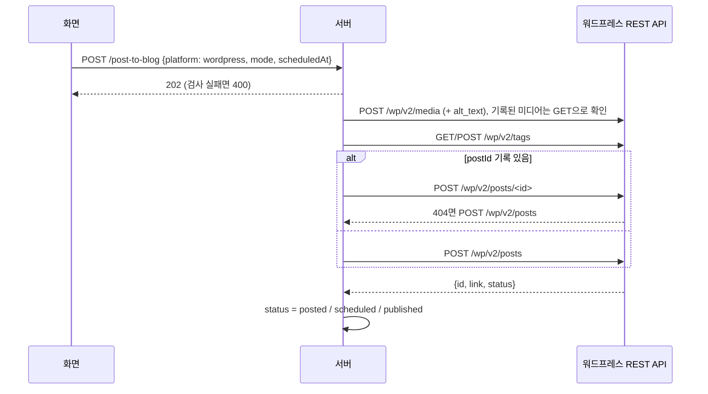
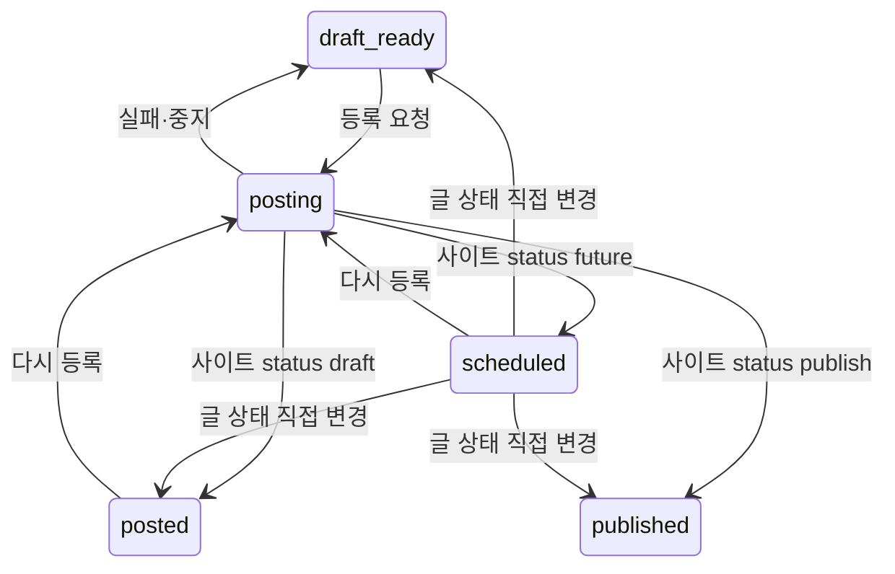

# 워드프레스 API 등록 플로우

## 목적
검토한 초안을 워드프레스 REST API로 사이트에 올린다. 크롬·Claude in Chrome·Claude 사용량이 필요 없고, 임시저장뿐 아니라 예약발행·자동발행도 할 수 있다. 연동 세부(인증, 요청, 오류 해석)는 [[_system/integrations/wordpress-rest]].

## 사전 조건
- 설정의 "워드프레스 설정"에 https 사이트 주소를 저장하고, 사용자명 + Application Password를 "연결 확인 후 저장"(사이트에 `users/me`로 인증·`edit_posts` 권한 확인 후 비밀 파일에 저장). 카테고리는 설정이 아니라 글을 올릴 때 글 화면에서 사이트 목록에서 고른다(설정에 기본 카테고리는 없음) → [[publishing/entities/블로그 설정]].

## 단계
| # | 단계 | 위치 | 관련 규칙 |
|---|---|---|---|
| 1 | 올릴 곳 "워드프레스" 선택 (워드프레스 기록이 있는 글은 처음부터 골라져 있음) | `JobDetail`, `NextStep` | [[publishing/business-rules/BR-PUB-015 올릴 블로그는 글마다 선택]] |
| 2 | 등록 방식 선택, 예약이면 공개 시각 입력(지금+1분 이후, 기본은 예전 예약 시각 또는 내일 오전 9시), 예약·자동은 확인 창. 방식 버튼·시각 칸은 네이버·티스토리와 같은 `PublishModeFields`/`usePublishMode`를 쓰고 안내 문구만 `WP_MODE_HINT` | `WordPressNext` | [[publishing/business-rules/BR-PUB-014 워드프레스 등록 방식과 예약 시각]] |
| 2a | 카테고리 선택(`CategoryField`): 사이트의 카테고리 목록(`GET /api/categories/wordpress`, 실시간)에서 고름. 처음 값은 마지막으로 고른 카테고리, 없으면 비어 있음(설정의 기본 카테고리는 없어짐) | `WordPressNext` | [[publishing/business-rules/BR-PUB-020 카테고리 선택]] |
| 3 | 편집 저장(`flush`) → `POST /post-to-blog {platform: "wordpress", mode, scheduledAt, category?: {id, name}}` | `JobDetail` | |
| 4 | 서버 검사: 초안·진행 중·사이트 주소 있음, 카테고리가 있으면 `id` 필수(없으면 400), 주소가 https로 정리됨, 예약 시각 확인, 인증 정보 있음 (확장 검사 없음) → `markBusy(posting, platform)`(올리는 블로그 `postingTo` 기록) → 202 | `routes/jobs.ts` | [[publishing/business-rules/BR-PUB-002 블로그 ID 형식]] |
| 5 | `runPost` → 크롬 큐 없이 `doWordPressPost`: 상태 posting(`postingTo: wordpress`), 목록 배지는 다른 블로그와 같은 "블로그 임시저장 중", 로그 "워드프레스 API로 <방식> 시작" | `pipeline.ts` | [[publishing/business-rules/BR-PUB-004 크롬 작업 직렬화]] |
| 6 | 예약 시각 재확인 → 썸네일·본문 이미지 업로드(기록된 미디어는 재사용), 각 이미지에 `alt_text` | `publishToWordPress`, `ensureMedia` | [[publishing/business-rules/BR-PUB-008 생성되지 않은 이미지 건너뜀]], [[publishing/business-rules/BR-PUB-009 네이버 이미지 파일 이름과 크기]] |
| 7 | 태그 이름 → ID (없으면 만듦) | `resolveTagIds` | [[publishing/business-rules/BR-PUB-006 태그 입력 위치]] |
| 8 | 본문을 Gutenberg 블록으로(`postToBlocks`, 표는 공용 `tableHtml`에 본문 폭·넉넉한 칸 여백을 더한 HTML 블록 `wpTableHtml`), 썸네일은 `featured_media`, 요약은 `excerpt`, 카테고리(**이번에 고른 카테고리 `id`만 `categories`로 보내고, 안 골랐으면 보내지 않아 사이트 기본 카테고리**), 예약이면 `date_gmt` | `publishToWordPress` | [[publishing/business-rules/BR-PUB-005 썸네일 위치]], [[publishing/business-rules/BR-PUB-007 소제목 위 빈 줄]] |
| 9 | 기록된 `postId`가 있으면 그 글을 갱신(404면 새 글), 없으면 새 글. 예약했던 글을 자동발행으로 갱신하면 공개 시각(`date_gmt`)을 지금으로 보낸다 (아니면 사이트가 예약으로 되돌림) | `publishToWordPress` | [[publishing/business-rules/BR-PUB-016 워드프레스 재등록은 같은 글 갱신]] |
| 10 | 사이트가 돌려준 상태로 작업 상태 결정 (`publish`→블로그 발행완료, `future`→블로그 발행 예약, 그 밖→블로그 임시저장 완료), `job.wordpress` 기록, 로그 "워드프레스에 <발행했습니다/예약했습니다/임시저장했습니다>: <링크>". 요청과 다르면 "확인 필요" | `doWordPressPost` | [[publishing/business-rules/BR-PUB-011 입력 결과 검증]] |
| 11 | 화면: "워드프레스에 임시저장했습니다/예약했습니다…" + "글 열기", "다시 등록 (<방식>)". 상태를 직접 바꾸려면 진행 단계 아래 "글 상태" 한 줄 | `WordPressNext`, `StatusPicker` | [[publishing/business-rules/BR-PUB-013 발행 완료 표시]], [[publishing/business-rules/BR-PUB-019 다른 블로그에 올린 글 표시]] |

## 시퀀스

## 상태

## 실패 / 예외 경로
| 상황 | 결과 | 사용자에게 보이는 것 |
|---|---|---|
| 카테고리에 `id`가 없음 / 모양이 틀림 | 400 | "워드프레스 카테고리는 사이트 목록에서 골라 주세요." / "카테고리 값이 올바르지 않습니다." |
| 사이트 주소 없음 | 400 | "먼저 설정에서 워드프레스 사이트 주소를 입력하세요." |
| 인증 정보 없음 | 400 | "워드프레스 연결 정보가 없습니다. 설정 → 워드프레스 설정에서 연결하세요." |
| 예약 시각 문제 | 400 | "예약 시각은 지금보다 1분 이상 뒤여야 합니다." 등 |
| 인증 실패(401), 권한 없음(403), REST API 없음(404), 다른 주소로 이동(3xx), 30초 응답 없음 | 실패 → draft_ready | 원인별 한국어 메시지 ([[_system/integrations/wordpress-rest]]) |
| 이미지 업로드 실패 | 실패 → draft_ready | "<썸네일/본문 이미지 #n> 업로드에 실패했습니다: …" |
| 중지 | draft_ready | "워드프레스 등록을 중지했습니다." |

## 관련 엔티티
[[publishing/entities/블로그 설정]], [[writing/entities/Job]], [[writing/entities/Post]]

## 관련 모듈
[[_system/modules/server-wordpress]], [[_system/modules/server-routes]], [[_system/modules/web-job]], [[_system/modules/tests]]

## 변경 이력
| 날짜 | 변경 | 근거 |
|---|---|---|
| 2026-10-09 | 흐름 변화 없음. 화면의 방식 선택을 네이버·티스토리와 공용(`PublishModeFields`/`usePublishMode`)으로, 등록 뒤 "발행 완료로 표시"·"초안 완료로 되돌리기" 버튼 → "글 상태" 한 줄, 상태 이름 변경(블로그 임시저장 완료·블로그 발행 예약·블로그 발행완료), 올리는 중 배지 "워드프레스 등록 중" → "블로그 임시저장 중". 근거 줄 번호 갱신 | 커밋 65bfa3e |
| 2026-10-09 | 카테고리를 올릴 때마다 고름 (요청 `category.id`가 설정의 `wordpressCategoryId`보다 우선, 마지막 선택 기억). 그 밖의 흐름은 그대로 | 커밋 b7ced30, `blog-writer:server/wordpress.ts:260-301`, `blog-writer:server/routes/jobs.ts:113-123` |
| 2026-10-09 | 워드프레스 기본 카테고리 설정 제거: 카테고리 결정이 "고른 `id` > 설정 `wordpressCategoryId` > 사이트 기본" → "고른 `id` > 사이트 기본"으로 바뀜. 단계 2a 처음 값에서 설정 기본값 제거. 그 밖의 흐름은 그대로 | 커밋 4ffb5eb, `blog-writer:server/wordpress.ts:300-301`, `blog-writer:server/routes/categories.ts:27-34` |
