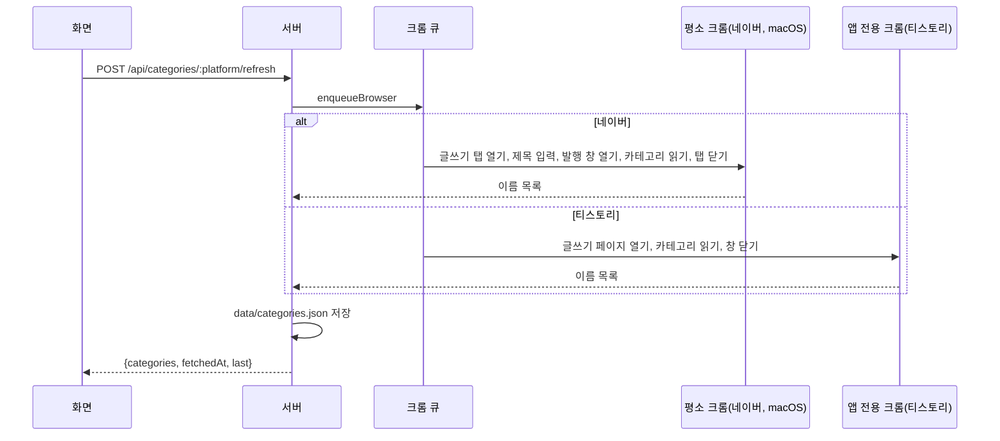

# 카테고리 목록 불러오기 플로우

> 신뢰도 medium: 에디터 화면에서 카테고리 칸을 찾고 목록을 읽는 부분은 화면 글자·모양을 보는 휴리스틱이며 실제 사이트에서 확인되지 않았다 ([[publishing/open-questions]] #16, #17, #18). 워드프레스는 이 플로우를 타지 않고 사이트에서 바로 읽는다.

## 목적
네이버·티스토리는 카테고리를 읽을 공개 API가 없어, 블로그 에디터를 열어 카테고리 이름 목록을 읽어 저장해 둔다. 저장된 목록은 글 화면의 카테고리 선택 상자에 쓰인다 → [[publishing/business-rules/BR-PUB-020 카테고리 선택]].

## 단계
| # | 단계 | 위치 | 관련 규칙 |
|---|---|---|---|
| 1 | "목록 불러오기" 클릭 → `POST /api/categories/:platform/refresh` (안내 "블로그 글쓰기 화면을 열어 읽는 중입니다 (30초쯤 걸릴 수 있습니다). 글은 저장하지 않습니다.") | 화면 `useCategories.refresh` | |
| 2 | 서버 검사: 네이버·티스토리만(그 밖 404), 그 블로그 ID가 설정돼 있어야 함(없으면 400), 네이버는 macOS(평소 크롬)에서만(아니면 400) | `routes/categories.ts` | [[publishing/business-rules/BR-PUB-002 블로그 ID 형식]] |
| 3 | `enqueueBrowser`로 전역 크롬 큐에서 실행 (다른 크롬 작업과 한 줄) | `routes/categories.ts` | [[publishing/business-rules/BR-PUB-004 크롬 작업 직렬화]] |
| 4a | **네이버** `readNaverCategories`(평소 크롬, AppleScript): 글쓰기 탭 열기(`openNaverEditor`: 로그인이면 중단, 이어쓰기 팝업 취소, 남은 글이면 중단) → 제목 칸에 짧은 제목("카테고리 확인") 붙여넣기(제목이 비면 발행 버튼이 안 눌릴 수 있어서) → 발행 창만 열기(발행 창 단계의 첫 단계) → `readCategories(…, "layer()")` → 탭 닫기 (저장도 발행도 하지 않음) | `userChrome.ts` | [[publishing/business-rules/BR-PUB-018 발행 창 단계와 안전장치]] |
| 4b | **티스토리** `readTistoryCategoriesWithChrome`(앱 전용 크롬, Playwright): 글쓰기 페이지로 이동(로그인이면 대기/중단), 제목 칸이 뜰 때까지 대기 → `readCategories(…, "document")` → 크롬 창 닫기 (아무것도 입력·저장하지 않음) | `runner.ts`, `adapters.ts` | [[publishing/business-rules/BR-PUB-012 로그인 화면이면 멈춤]] |
| 5 | `readCategories`: 카테고리 칸 열기(10초) → 목록 읽기(8초): `<select>`면 선택지, 버튼이면 누르기 전 화면 요소에 표시를 남기고 누른 뒤 **표시 없는 새 요소의 짧은 글자들**(글자 비교가 아니다: 칸이 현재 선택값을 보여 줘 첫 항목의 글자가 이미 화면에 있다) → Esc로 닫기 → 이름 정리(40자 이하, "카테고리" 글자 제외, 중복 제거, 최대 100개). 없으면 오류 | `category.ts` | |
| 6 | 정리된 이름을 `data/categories.json`의 `lists[platform]`에 블로그 ID·읽은 시각과 함께 저장 | `saveCategoryList` | |
| 7 | 응답 `{categories, fetchedAt, last}` → 선택 상자에 반영 (고른 값은 유지, 목록에 없어도 선택 상자에 남김) | 화면 | |

## 시퀀스

## 실패 / 예외 경로
| 상황 | 결과 | 사용자에게 보이는 것 |
|---|---|---|
| 블로그 ID 없음 | 400 | "먼저 설정에서 <블로그> 블로그 ID를 입력하세요." |
| 네이버인데 macOS가 아님 | 400 | "네이버 카테고리 목록 불러오기는 macOS에서만 됩니다." |
| 워드프레스/모르는 블로그 | 404 | "네이버·티스토리에서만 목록을 불러옵니다." |
| 칸을 못 찾음, 목록이 안 읽힘, 시간 초과, 로그인 화면 등 | 502 | "카테고리 목록을 불러오지 못했습니다: <이유>" + 이어서 "화면 구조 (문제 확인용, 글 본문은 빠짐):" (최대 3000자) |
| 읽은 항목이 카테고리 이름처럼 안 보임 | 502 | "카테고리 목록 읽기: 읽은 항목이 카테고리 이름처럼 보이지 않습니다" |

## 관련 엔티티
[[publishing/entities/블로그 설정]], `data/categories.json` → [[_system/data-storage]]

## 변경 이력
| 날짜 | 변경 | 근거 |
|---|---|---|
| 2026-10-09 | 최초 기록 | 커밋 b7ced30 |
| 2026-10-09 | 목록 읽기에서 첫 항목이 빠지던 문제 수정 (새 요소를 표시로 구분) | 커밋 19d0364, `blog-writer:server/browser/category.ts:41-43` |
