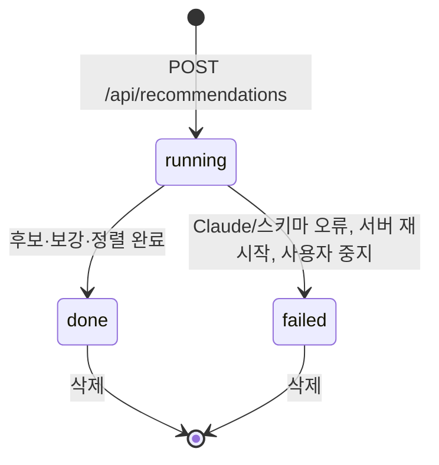

# Recommendation (주제 추천)

## 의미
사용자가 입력한 분야 하나에 대한 추천 실행 한 번과 그 결과(후보 목록). 기록으로 남아 다시 볼 수 있다.

## 속성
| 속성 | 타입 | 의미 | 화면 표시 |
|---|---|---|---|
| `id` | uuid | | |
| `field` | string 2~100 | 분야 (예: 청약·부동산) | 기록 버튼 "분야 · 날짜" |
| `status` | running/done/failed | | "(진행 중)", "(실패)" |
| `anchorKeyword` | string? | 분야 대표 검색어 (데이터랩 비교 기준) | "기준 키워드" |
| `datalab` | pending/ok/not_configured/failed | 데이터랩 사용 결과 | 순위 안내 문구 |
| `period` | {start,end}? | 데이터랩 조회 기간 | "데이터랩 시작 ~ 끝" |
| `candidates` | TopicCandidate[] | → [[topic/entities/TopicCandidate]] | 후보 카드 |
| `logs`, `error` | | 진행 로그·실패 | 로그, 오류 |

## 상태와 전이

데이터랩 실패는 `failed`가 아니라 `done` + `datalab: "failed"`.

## 저장 위치
`data/recommendations/<id>.json`. 진행 중 갱신은 하나씩 줄 세워(`serialQueue`) 임시 파일에 쓴 뒤 바꿔 넣는다(`writeJsonAtomic`, `blog-writer:server/recommend.ts:19-29`). 처음 만들 때(`startRecommendation`)만 파일에 바로 쓴다 (`blog-writer:server/recommend.ts:156-158`).

## 적용되는 규칙
[[topic/business-rules/BR-TOP-001 추천 후보 조건]], [[topic/business-rules/BR-TOP-004 추천 순위]], [[topic/business-rules/BR-TOP-005 추천 동시 실행과 입력 제한]]
