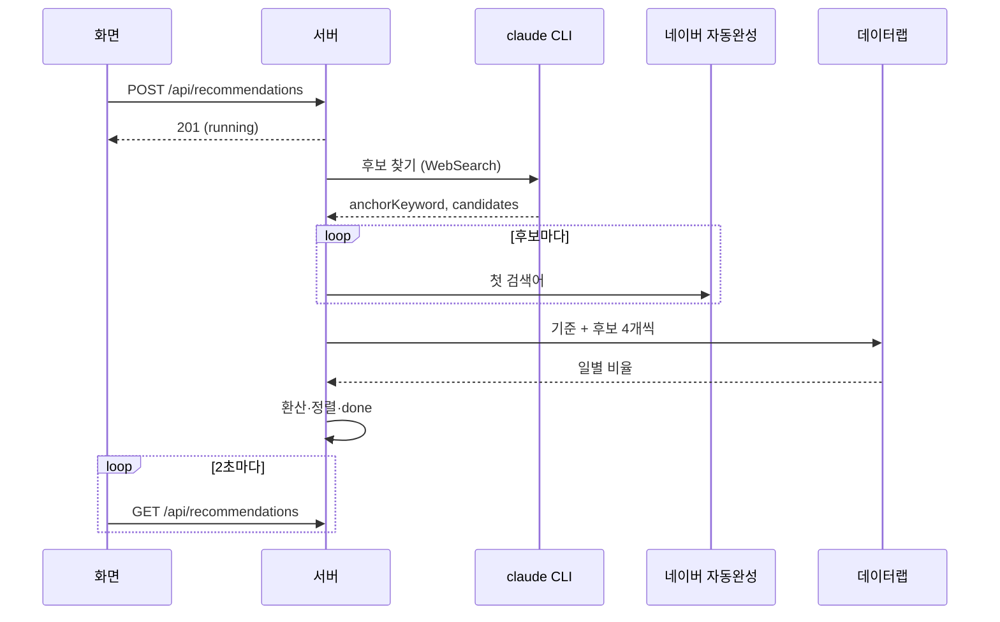

# 주제 추천 플로우

## 목적
무엇을 쓸지 모를 때, 분야에서 지금 검색이 많을 만한 주제 후보를 근거와 함께 받아 바로 새 글로 넘긴다.

## 단계
| # | 단계 | 위치 | 관련 규칙 |
|---|---|---|---|
| 1 | 분야 입력(2자 이상) → `POST /api/recommendations` | `Recommend` | [[topic/business-rules/BR-TOP-005 추천 동시 실행과 입력 제한]] |
| 2 | 추천 생성(`running`, datalab `pending`) → 201, 백그라운드 실행. 화면 2초 폴링 | `startRecommendation` | |
| 3 | 1단계: Claude + WebSearch/WebFetch로 후보 10~12개와 기준 키워드, 이미 쓴 글 제외. 로그 "웹 검색: …" | `run` | [[topic/business-rules/BR-TOP-001 추천 후보 조건]] |
| 4 | 후보 저장 (검색어 ≤3, 근거 http(s)) | `run` | |
| 5 | 2단계: 후보마다 첫 검색어 네이버 자동완성 개수 | `naverAutocomplete` | [[_system/integrations/naver-search]] |
| 6 | 3단계: 데이터랩 관심도(키 없으면 건너뜀, 실패면 기록). 후보마다 `interestStat`으로 환산 | `compareInterest`, `interestStat` | [[topic/business-rules/BR-TOP-002 검색 관심도 환산]], [[topic/business-rules/BR-TOP-003 상승세 계산]], [[topic/business-rules/BR-TOP-006 데이터랩 키 확인과 우선순위]] |
| 7 | 데이터랩 ok면 정렬, 상태 done, 로그 "추천 완료" | `run` | [[topic/business-rules/BR-TOP-004 추천 순위]] |
| 8 | 후보 카드 표시. "이 주제로 글쓰기 →" → 새 글 폼에 주제와 근거 URL(링크 칸) 채움 | `CandidateCard`, `App` | [[writing/business-rules/BR-WRT-010 주제와 참고 링크 입력 검증]] |
| 9 | 새 글에서 "딥서칭 시작" | | [[writing/flows/초안 작성 플로우]] |

## 시퀀스

## 실패 / 예외 경로
| 상황 | 결과 | 사용자에게 보이는 것 |
|---|---|---|
| Claude 실패·스키마 불일치 | failed | 오류 |
| 데이터랩 키 없음 | done, not_configured | "순위 없이 찾은 순서대로" |
| 데이터랩 오류 | done, failed | 로그 "데이터랩 조회 실패: …" |
| 서버 재시작 | failed | "서버가 재시작되어 중단되었습니다." |
| 사용자가 "추천 중지" (2026-10-05 추가) | `POST /api/recommendations/:id/cancel` → failed (중지) | "사용자가 추천을 중지했습니다." |

## 관련 모듈
[[_system/modules/server-routes]] (`server/routes/recommendations.ts`), [[_system/modules/server-recommend]]

## 관련 엔티티
[[topic/entities/Recommendation]], [[topic/entities/TopicCandidate]]
