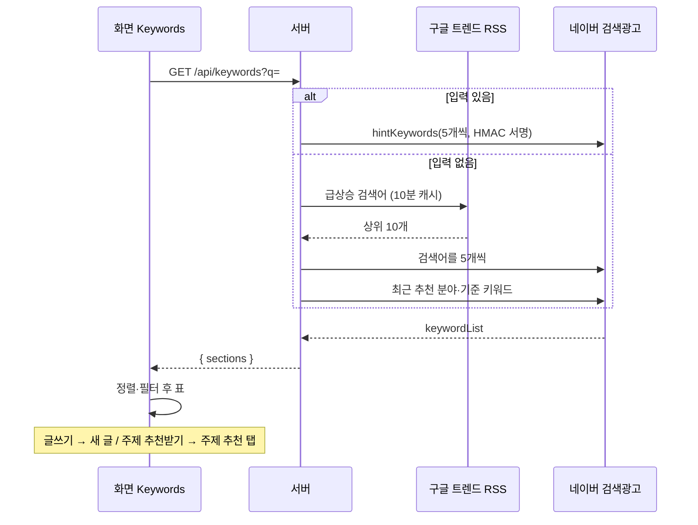

# 키워드 탐색 플로우

confidence가 medium인 이유: 코드 흐름은 테스트로 확인했지만(high) 네이버 검색광고 API·구글 트렌드 RSS의 실제 응답은 아직 확인하지 못했다 → [[topic/open-questions]] #5, #6.

## 목적
무엇을 쓸지 정하기 전에 키워드별 월간 검색량·경쟁을 보고, 검색량이 큰 키워드를 새 글 주제로 쓰거나 그 키워드를 분야로 주제 추천을 받는다.

## 단계
| # | 단계 | 위치 | 관련 규칙 |
|---|---|---|---|
| 1 | 탭을 열면 `GET /api/searchad`로 키 연결 여부 확인. 미연결이면 안내와 "설정에서 연결하기", 검색 버튼 비활성 | `Keywords` | [[topic/business-rules/BR-TOP-009 검색광고 키 확인과 우선순위]] |
| 2 | 키워드 입력(쉼표 등으로 최대 5개, 200자) 또는 비움 → `GET /api/keywords?q=` | `Keywords` → `routes/keywords.ts` | [[topic/business-rules/BR-TOP-007 키워드 검색량 표기와 집계]] |
| 3 | 검색광고 키 없으면 400 안내 | `exploreKeywords` | BR-TOP-009 |
| 4a | 입력 있음: 키워드를 정리해 5개씩 검색광고 키워드 도구 호출 → `input` 덩어리 | `lookupKeywords` | BR-TOP-007 |
| 4b | 입력 없음: 구글 트렌드 상위 10개(10분 캐시) → 조회, 그리고 최근 완료된 주제 추천 3개의 기준 키워드 → 조회 | `exploreWithoutInput`, `fetchTrending` | [[topic/business-rules/BR-TOP-008 입력 없는 키워드 탐색의 기준과 오류 처리]] |
| 5 | 합치기(같은 키워드는 큰 검색량), "< 10"→5, 검색량 큰 순 최대 200행 | `toRows` | BR-TOP-007 |
| 6 | 덩어리별 표: 정렬·최소 검색량·경쟁·키워드 필터는 화면에서 | `Keywords` | BR-TOP-007 |
| 7a | "이 키워드로 글쓰기" → 새 글 폼의 주제에 키워드, 링크 칸 비움 | `App` (`onUseKeyword`) | [[writing/business-rules/BR-WRT-010 주제와 참고 링크 입력 검증]] |
| 7b | "주제 추천받기" → `RecommendRequest {field, nonce}`를 만들어 주제 추천 탭으로 이동, 분야를 채워 즉시 시작 (키워드가 2자 미만이면 버튼 비활성) | `App` (`onRecommend`), `Recommend` | [[topic/flows/주제 추천 플로우]], [[topic/business-rules/BR-TOP-005 추천 동시 실행과 입력 제한]] |

## 시퀀스

## 실패 / 예외 경로
| 상황 | 결과 | 사용자에게 보이는 것 |
|---|---|---|
| 검색광고 키 없음 | 400 | "먼저 설정에서 네이버 검색광고 API 키를 연결하세요." |
| 키 오류(401/403)·한도(429)·기타 검색광고 오류 | 400, 전체 오류 | 원인 메시지 |
| 구글 트렌드 실패 | 그 덩어리만 `error` | "지금 뜨는 검색어" 카드에 오류, 추천 덩어리는 정상 |
| 입력 없고 추천 기록도 없고 트렌드도 실패 | 400 | "입력한 키워드가 없고 탐색할 기준도 없습니다 …" |
| 입력 200자 초과 | 400 | "키워드는 200자 이하로 입력하세요." |
| 키워드로 주제 추천 시작했는데 이미 추천 진행 중 | 서버 409 | 주제 추천 화면에 "이미 주제 추천이 진행 중입니다." |

## 관련 엔티티
[[topic/entities/KeywordRow]]
