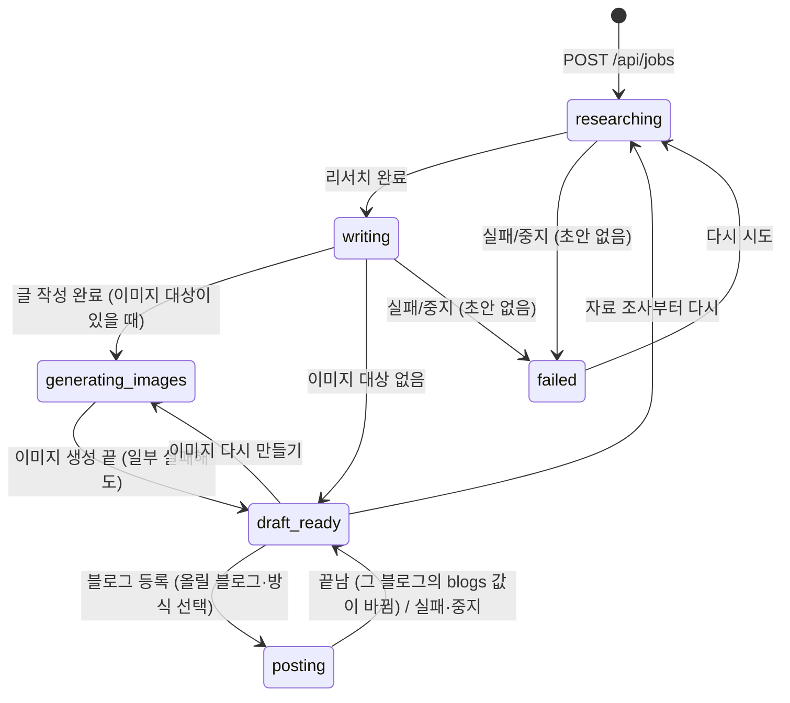
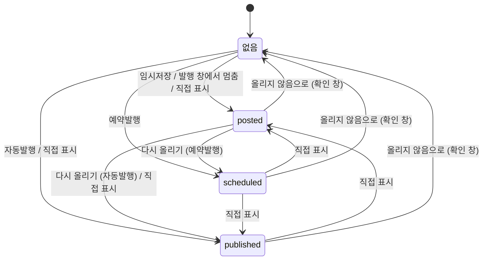

# Job (작업)

## 의미
주제 하나로 블로그 글 한 편을 만드는 단위. 화면 사이드바 "내 글"의 한 줄이다. 리서치 결과, 초안, 이미지, 진행 로그, 적용된 규칙 사본, 고른 분량·말투, **블로그별 상태**를 모두 담는다.

## 속성
| 속성 | 타입 | 의미 | 화면 표시 |
|---|---|---|---|
| `id` | uuid | 식별자, 파일 이름 | |
| `topic` | string | 사용자가 넣은 주제 (2~300자) | 제목이 생기기 전 목록 이름 |
| `links` | string[]? | 사용자가 준 참고 링크 (리서치에서 반드시 열어 봄) | |
| `status` | `JobStatus` | **글 자체의 진행 상태** 6종 (아래). 2026-10-10부터 블로그에 올린 결과는 여기가 아니라 `blogs`에 둔다 | 배지(올린 블로그가 없거나 진행 중일 때), 목록 필터 |
| `blogs` | `BlogStates`? | **블로그별 상태** `{naver?, tistory?, wordpress?}`. 값은 `{status: posted \| scheduled \| published, at}`. 올리지 않은 블로그는 키가 없다. 한 블로그에 올려도 다른 블로그의 값은 그대로 (2026-10-10) | 목록 배지 "네이버 발행완료" 등, "블로그별 글 상태" 줄, 진행 단계 |
| `imageOptions` | ImageOptions | 이 작업의 이미지 설정 → [[image/entities/ImageOptions]] | |
| `writingOptions` | `WritingOptions`? | 이 작업의 본문 목표 글자수(`targetChars`)와 말투(`tone`). 새 글을 만들 때 정하고, "분량·말투 바꿔 다시 쓰기"를 적용하면 바뀐다. 2026-10-10 전 작업에는 없다(2,500자·글쓰기 규칙대로의 말투로 본다) → [[writing/business-rules/BR-WRT-001 본문 분량 상한]], [[writing/business-rules/BR-WRT-019 본문 말투 선택]] | 글자수 칩 "목표 약 N자", 다시 쓰기의 처음 값 |
| `postingTo` | Platform? | 올리는 중인(또는 마지막으로 올린) 블로그. 올리는 중(`posting`) 안내 문구(워드프레스 API / 크롬)와, 목록 필터에서 "그 블로그에 올리는 중"을 가리는 데 쓴다. 2026-10-10부터 "다른 블로그에 올린 글" 판단에는 쓰지 않는다(`blogs`로 판단) | 올리는 중 안내 문구 (`blog-writer:src/job/NextStep.tsx:68-75`) |
| `generatingImages`, `regeneratingImages` | string[]? | 지금 만드는 이미지 키(`thumbnail`/`body-<n>`)와 그중 이미 파일이 있던 것. 한 장씩 동시에 만들 수 있어 실행마다 더하고 뺀다 | 이미지별 진행 표시 |
| `imageRunsOnly` | boolean? | 이미지를 한 장씩 다시 만드는 것만 진행 중 (다른 이미지는 더 만들거나 올릴 수 있음). 마지막 진행이 끝나면 지움 | 이미지 도구를 계속 쓸 수 있음 |
| `researchNotes` | string? | 리서치 노트 (사실마다 출처). 분량·말투 바꿔 다시 쓰기에서 다시 쓴다 | "리서치 노트" |
| `rulesSnapshot` | string? | 작업 시작 시점의 글쓰기 규칙 사본. 제목 다시 만들기에서도 쓴다 | "이 글에 적용된 글쓰기 규칙" |
| `sources` | Source[] | 리서치에서 실제로 연 페이지 {title,url,kind(official/press/blog/other)} | "수집한 출처" |
| `post` | Post? | 초안 → [[writing/entities/Post]] | 미리보기/편집 |
| `logs` | {at,message}[] | 진행 로그 | "진행 로그", 진행 중 마지막 줄 |
| `error` | string? | 마지막 실패 메시지 | 빨간 배너 |
| `editProposal` | `EditProposal`? | 프롬프트로 글을 고치는 중이거나, 고친 결과를 적용하기 전인 제안 (아래 "EditProposal"). 적용·버리기·중지·새 초안이면 지운다 | "프롬프트로 글 고치기" 카드 |
| `wordpress` | `WordPressRecord`? | 워드프레스 API로 올린 글 기록: `postId`, `link`, `mode`(draft/schedule/publish), `scheduledAt`, `mediaIds`(올린 이미지 파일명 → 사이트 미디어 {id,url}). 다시 등록하면 새 글 대신 이 글을 갱신한다 → [[publishing/overview]] | "글 열기" 링크, 예약 시각 |

## 상태와 전이

### 글 자체의 진행 상태 (`status`)
| 상태 | 화면 이름 (`STATUS_LABEL`) | 의미 |
|---|---|---|
| `researching` | 자료 조사 중 | 리서치(딥서칭) 중 |
| `writing` | 글 작성 중 | 리서치 끝, 글 작성·네이버 검색어 수집 중 |
| `generating_images` | 이미지 생성 중 | 이미지를 만드는 중 |
| `draft_ready` | 초안 검토 | 초안이 있고 진행 중인 일이 없음. **블로그에 올린 뒤에도 여기로 돌아온다** (블로그 결과는 `blogs`) |
| `posting` | 블로그 임시저장 중 | 블로그(`postingTo`)에 올리는 중 |
| `failed` | 실패 | 초안 없이 실패·중지 |

### 블로그별 상태 (`blogs[블로그]`)
| 값 | 화면 이름 (`BLOG_STATUS_LABEL`, 배지는 `blogStatusText` "네이버 발행완료") | 의미 |
|---|---|---|
| (없음) | 올리지 않음 | 그 블로그에는 아직 올리지 않음 |
| `posted` | 임시저장 완료 | 그 블로그에 임시저장됨 (발행 안 됨) |
| `scheduled` | 발행 예약 | 그 블로그에 예약발행을 걸어 둠 (앱이 예약발행했을 때만 생김) |
| `published` | 발행완료 | 그 블로그에 공개됨 (자동발행 결과이거나 사용자가 표시) |

| 전이 | 조건 | 일어나는 곳 |
|---|---|---|
| → researching | 생성, 재시도(`markBusy`) | `blog-writer:server/store.ts:107-128`, `blog-writer:server/routes/jobs.ts:226-236`, `blog-writer:server/routes/util.ts:16-22` |
| researching → writing | `deepResearch` 성공 | `blog-writer:server/pipeline.ts:103-106` |
| → generating_images | 만들 이미지가 1개 이상 | `blog-writer:server/pipeline.ts:301-306` |
| → draft_ready | 초안 완성, 이미지 작업 끝(성공·실패·중지 모두. 한 장씩 동시에 만드는 중이면 마지막 이미지가 끝날 때), 블로그 등록이 끝남·실패·중지(크롬·워드프레스), 재시작 복구(초안 있음) | `blog-writer:server/pipeline.ts:144-146`, `:232`, `:257`, `:30-33`, `:46-52`, `blog-writer:server/store.ts:154-173` |
| → failed | 초안 없이 실패/중지, 재시작 복구(초안 없음) | `blog-writer:server/pipeline.ts:150-152`, `blog-writer:server/store.ts:165` |
| 네이버·티스토리 등록 끝 | 고른 방식대로 **그 블로그만**: 임시저장 → `posted`, 예약발행 → `scheduled`, 자동발행 → `published`. 발행 창에서 멈추면(`PublishStepError`) 그 블로그 `posted` + `error`에 이유. 글은 `draft_ready` (`setBlogStatus`) | `blog-writer:server/pipeline.ts:28-33`, `:495-509` |
| 워드프레스 등록 끝 | 사이트가 돌려준 글 상태(`draft`/`future`/`publish`)대로 `blogs.wordpress`만 정한다. 요청한 방식과 다르면 "확인 필요" 로그 | `blog-writer:server/pipeline.ts:429-437` |
| 블로그별 상태 직접 변경 | 상세 화면 "블로그별 글 상태"에서 블로그마다 [올리지 않음 \| 임시저장 완료 \| 발행완료] (`PUT /api/jobs/:id/blogs/:platform/status`, `MANUAL_STATUSES = none·posted·published`). 초안이 있는 글만, 같은 상태로는 400, 진행 중 409. 다른 블로그와 글 진행 상태는 그대로. 올리지 않음으로 되돌릴 때만 확인 창. 앱이 블로그에 올리거나 발행하지는 않는다 | `blog-writer:server/routes/jobs.ts:186-215`, `blog-writer:shared/types.ts:295-297`, `blog-writer:src/job/NextStep.tsx:11-43` |
| 다시 올리기 | 서버는 초안만 있으면 받는다. 화면은 **고른 블로그가** 발행완료면 올리기 버튼 대신 "<블로그>에 발행완료된 글입니다. … 다른 블로그에도 올릴 수 있습니다."와 올릴 곳 선택을 보여 준다 | `blog-writer:src/job/NextStep.tsx:111-139` |
| 이미지 다시 만들기·자료 조사부터 다시·고친 결과 적용 | **블로그별 상태는 그대로** 둔다 (사용자 결정 2026-10-10. 예전에는 이미지를 다시 만들면 발행완료 표시가 풀렸다) | `blog-writer:server/pipeline.ts:223-260` |

수기 변경 로그: "<블로그 이름> 상태를 <상태 이름>(으)로 표시했습니다." (`blog-writer:server/routes/jobs.ts:212`). 화면의 "블로그별 글 상태"는 진행 단계 바로 아래에 있고, 초안이 있고 진행 중이 아닐 때 블로그 3개(네이버·티스토리·워드프레스, 설정이 없는 블로그도)를 모두 보여 준다. 발행 예약인 블로그에는 "지금은 발행 예약 상태입니다."를 덧붙인다 (`blog-writer:src/job/JobDetail.tsx:227`). 테스트: `blog-writer:tests/api.test.ts:164-190`, `blog-writer:tests/wordpress.test.ts:127-141`.

**진행 단계 표시**(`Progress`)는 블로그들 중 가장 앞선 상태(`furthestBlogStatus`: published > scheduled > posted)로 "블로그 임시저장 → 블로그 발행완료" 단계를 그린다 (`blog-writer:src/job/Progress.tsx:17-30`, `blog-writer:shared/blogStatus.ts:12-18`).

**예전 글 옮기기 (2026-10-10)**: 예전 파일은 `status`에 `posted`/`scheduled`/`published`를 가졌다. 읽을 때(`getJob`, `listJobs`) `migrateJob`이 블로그별 상태로 옮기고 `status`를 `draft_ready`로 바꾼다. 파일은 다음에 저장할 때 바뀐다.
- `published` → **네이버와 워드프레스 모두** 발행완료 (사용자 결정. 실제로 어느 블로그에 발행했는지와 관계없음)
- `posted`·`scheduled` → 그 상태 그대로, `postingTo` → 워드프레스 기록(`wordpress`)이 있으면 워드프레스 → 둘 다 없으면 네이버 순으로 고른 블로그에 (`blog-writer:server/store.ts:60-80`, 테스트 `blog-writer:tests/api.test.ts:192-214`)

`published`(발행완료)는 세 경우다: 사용자가 블로그에서 직접 발행한 글을 표시한 것, 워드프레스 API 자동발행 결과, 네이버·티스토리 자동발행 결과 → [[publishing/business-rules/BR-PUB-013 발행 완료 표시]]. `scheduled`는 예약 시각이 지나도 앱이 바꾸지 않는다 (사용자가 직접 표시) → [[writing/open-questions]] #8. 진행 중 상태 묶음 `BUSY_STATUSES = researching, writing, generating_images, posting` (`blog-writer:shared/types.ts:293`) — 화면 폴링·버튼 비활성·재시작 복구 대상.

## EditProposal (프롬프트로 글 고치기 제안)
`Job.editProposal`. 상태(`status`)는 `running`(Claude가 고치는 중) / `ready`(결과 준비, 아직 글에 안 들어감) / `failed`. 작업 `status`와는 별개로 움직인다 (고치는 동안에도 `draft_ready` 그대로).

| 필드 | 타입 | 의미 |
|---|---|---|
| `prompt` | string | 사용자가 쓴 수정 요청 (분량·말투 다시 쓰기에서는 추가 요청이라 비어 있을 수 있음) |
| `writing` | WritingOptions? | 분량·말투를 바꿔 글 전체를 다시 쓰는 제안이면 새 분량·말투. 적용하면 `Job.writingOptions`가 이 값이 된다 (2026-10-10) |
| `range` | {start,end}? | 고치는 블록 범위(끝 포함). 없으면 글 전체 |
| `status` | running \| ready \| failed | |
| `createdAt` | string | 제안 시작 시각 |
| `error` | string? | failed일 때 이유 |
| `before`, `after` | PostBlock[]? | ready일 때 범위의 원래 블록과 고친 블록 (이미지는 원래 이미지 그대로) |
| `title`, `summary` | string? | 글 전체를 고칠 때의 새 제목·요약 |
| `note` | string? | 무엇을 어떻게 고쳤는지 한두 문장 |
| `charsBefore`, `charsAfter` | number? | 본문 글자 수 (적용 전·후, 공백 포함) |

**busy에 미치는 영향**: `editProposal.status === "running"`이면 화면은 `BUSY_STATUSES`와 같이 "진행 중"으로 본다 (폴링, 버튼 비활성, 안내 문구 "프롬프트로 글을 고치는 중입니다…"). 서버도 그동안 작업을 `isRunning`으로 보아 글 수정·올리기·이미지 작업을 409로 막는다. `ready`·`failed`는 막지 않는다 → [[writing/business-rules/BR-WRT-017 고친 결과 적용 조건과 잠금]], [[writing/flows/프롬프트로 글 고치기 플로우]]. 근거: `blog-writer:shared/types.ts:330-355`, `blog-writer:src/job/JobDetail.tsx:40`, `blog-writer:src/App.tsx:87`, `blog-writer:src/job/NextStep.tsx:69`.

## 저장 위치
`<데이터 폴더>/jobs/<id>.json` (데이터 폴더는 기본 `data/`, 환경 변수 `BLOG_WRITER_DATA_DIR`로 바꿀 수 있음). 쓰기는 id별 줄 세우기(`keyedQueue`) + 임시 파일 후 이름 바꾸기(`writeJsonAtomic`, `server/fsutil.ts`) → [[_system/data-storage]]

## 적용되는 규칙
[[writing/business-rules/BR-WRT-010 주제와 참고 링크 입력 검증]], [[writing/business-rules/BR-WRT-011 작업 중복 실행과 진행 중 변경 금지]], [[writing/business-rules/BR-WRT-012 중단 시 작업 상태 복구]], [[writing/business-rules/BR-WRT-009 글쓰기 규칙 적용 시점]], [[writing/business-rules/BR-WRT-016 프롬프트로 글 고치기]], [[writing/business-rules/BR-WRT-017 고친 결과 적용 조건과 잠금]], [[writing/business-rules/BR-WRT-001 본문 분량 상한]], [[writing/business-rules/BR-WRT-019 본문 말투 선택]], [[publishing/business-rules/BR-PUB-013 발행 완료 표시]]

## 변경 이력
| 날짜 | 변경 | 근거 |
|---|---|---|
| 2026-10-07 | 상태 `scheduled`(예약됨) 추가, 워드프레스 등록 결과로 posted/scheduled/published 결정, `wordpress` 기록 추가, 수기 전이에 scheduled → published·draft_ready 추가 | `blog-writer:shared/types.ts:235-295`, `blog-writer:server/pipeline.ts:347-381`, `blog-writer:server/routes/jobs.ts:179-184` |
| 2026-10-07 | `postingTo` 추가, 올리는 중 라벨이 블로그에 따라 "워드프레스 등록 중"/"크롬 작성 중"으로 갈림 (워드프레스는 크롬을 쓰지 않는데 "크롬 작성 중"으로 보이던 것을 고침) | `blog-writer:shared/labels.ts:4-20`, `blog-writer:server/routes/util.ts:16-23`, `blog-writer:server/pipeline.ts:355`, `:343` |
| 2026-10-08 | `imageRunsOnly` 추가, 진행 이미지 목록을 실행마다 더하고 빼기 (이미지 한 장씩 동시 실행) | `blog-writer:shared/types.ts:283-288`, `blog-writer:server/pipeline.ts:270-299` |
| 2026-10-09 | 상태 화면 이름 변경(자료 조사 중 / 초안 검토 / 블로그 임시저장 중·완료 / 블로그 발행 예약 / 블로그 발행완료), 올리는 중 라벨이 블로그와 관계없이 같아짐. 네이버·티스토리도 예약발행·자동발행 결과로 scheduled·published가 되고, 발행 창에서 멈추면 posted + 오류. 수기 상태 변경을 `MANUAL_TRANSITIONS`에서 `canSetStatus`(초안 검토 이후 글) + `MANUAL_STATUSES`(초안 검토·임시저장 완료·발행완료 중 다른 상태)로 바꿈 → draft_ready → posted·published, scheduled → posted가 새로 가능 | `blog-writer:shared/labels.ts:4-19`, `blog-writer:shared/types.ts:295-298`, `blog-writer:server/routes/jobs.ts:187-215`, `blog-writer:server/pipeline.ts:495-508` |
| 2026-10-09 | `editProposal`(프롬프트로 글 고치기 제안) 추가. 제안이 만들어지는 동안은 busy로 보고 글 수정·올리기·이미지 작업을 막음 | `blog-writer:shared/types.ts:331-353`, `:343`, `blog-writer:server/pipeline.ts:167-218` |
| 2026-10-10 | **상태 분리**: `status`는 글 자체의 진행 상태 6종(researching·writing·generating_images·draft_ready·posting·failed)만, 블로그 결과는 `blogs`(블로그별 posted·scheduled·published)로. 한 블로그에 올려도 다른 블로그 상태는 그대로, 올린 뒤 글은 draft_ready. 수기 변경은 블로그별(`PUT /api/jobs/:id/blogs/:platform/status`, 올리지 않음·임시저장 완료·발행완료), `canSetStatus`·`PUT /api/jobs/:id/status` 삭제. 이미지 다시 만들기 등에서 블로그 상태 유지. 예전 글은 읽을 때 옮김. `writingOptions`, `editProposal.writing` 추가 (사용자 결정: 예전 발행완료는 네이버·워드프레스 모두 발행완료, 블로그별 상태 유지, 블로그별 한 줄씩 수기 변경) | 커밋 afc7c10, `blog-writer:shared/types.ts:260-297`, `blog-writer:server/store.ts:60-80`, `blog-writer:server/routes/jobs.ts:186-215` |
