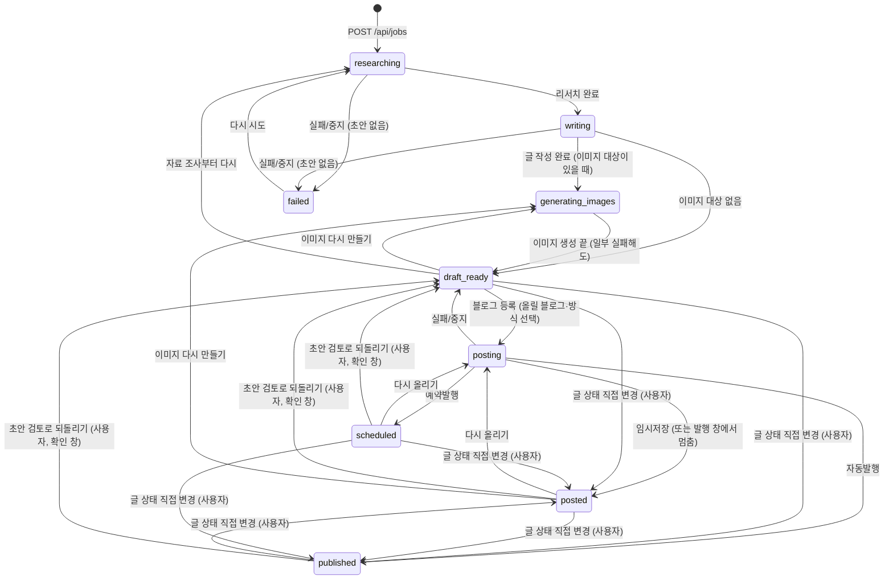

# Job (작업)

## 의미
주제 하나로 블로그 글 한 편을 만드는 단위. 화면 사이드바 "내 글"의 한 줄이다. 리서치 결과, 초안, 이미지, 진행 로그, 적용된 규칙 사본을 모두 담는다.

## 속성
| 속성 | 타입 | 의미 | 화면 표시 |
|---|---|---|---|
| `id` | uuid | 식별자, 파일 이름 | |
| `topic` | string | 사용자가 넣은 주제 (2~300자) | 제목이 생기기 전 목록 이름 |
| `links` | string[]? | 사용자가 준 참고 링크 (리서치에서 반드시 열어 봄) | |
| `status` | `JobStatus` | 진행 상태 9종 (아래) | 배지, 목록 상태 필터 |
| `imageOptions` | ImageOptions | 이 작업의 이미지 설정 → [[image/entities/ImageOptions]] | |
| `postingTo` | Platform? | 마지막으로 올린(또는 올리는 중인) 블로그. 다음 등록 때 덮어쓴다. 2026-10-09부터 상태 이름은 블로그와 관계없이 "블로그 임시저장 중"으로 같고(`statusLabel`이 더는 구분하지 않음), 이 값은 상세 안내에만 쓴다: 올리는 중 안내 문구(워드프레스 API / 크롬), 지금 고른 블로그가 이 값과 다르면 "다른 블로그에 올린 글입니다." | 상세 안내 문구 (`blog-writer:src/job/NextStep.tsx:56`, `:152`) |
| `generatingImages`, `regeneratingImages` | string[]? | 지금 만드는 이미지 키(`thumbnail`/`body-<n>`)와 그중 이미 파일이 있던 것. 한 장씩 동시에 만들 수 있어 실행마다 더하고 뺀다 | 이미지별 진행 표시 |
| `imageRunsOnly` | boolean? | 이미지를 한 장씩 다시 만드는 것만 진행 중 (다른 이미지는 더 만들거나 올릴 수 있음). 마지막 진행이 끝나면 지움 | 이미지 도구를 계속 쓸 수 있음 |
| `researchNotes` | string? | 리서치 노트 (사실마다 출처) | "리서치 노트" |
| `rulesSnapshot` | string? | 작업 시작 시점의 글쓰기 규칙 사본 | "이 글에 적용된 글쓰기 규칙" |
| `sources` | Source[] | 리서치에서 실제로 연 페이지 {title,url,kind(official/press/blog/other)} | "수집한 출처" |
| `post` | Post? | 초안 → [[writing/entities/Post]] | 미리보기/편집 |
| `logs` | {at,message}[] | 진행 로그 | "진행 로그", 진행 중 마지막 줄 |
| `error` | string? | 마지막 실패 메시지 | 빨간 배너 |
| `wordpress` | `WordPressRecord`? | 워드프레스 API로 올린 글 기록: `postId`, `link`, `mode`(draft/schedule/publish), `scheduledAt`, `mediaIds`(올린 이미지 파일명 → 사이트 미디어 {id,url}). 다시 등록하면 새 글 대신 이 글을 갱신한다 → [[publishing/overview]] | "글 열기" 링크, 예약 시각 |

## 상태와 전이
| 상태 | 화면 이름 (`STATUS_LABEL`) | 의미 |
|---|---|---|
| `researching` | 자료 조사 중 | 리서치(딥서칭) 중 |
| `writing` | 글 작성 중 | 리서치 끝, 글 작성·네이버 검색어 수집 중 |
| `generating_images` | 이미지 생성 중 | 이미지를 만드는 중 |
| `draft_ready` | 초안 검토 | 초안이 있고 진행 중인 일이 없음 |
| `posting` | 블로그 임시저장 중 | 블로그에 올리는 중 (네이버·티스토리·워드프레스 모두 같은 이름) |
| `posted` | 블로그 임시저장 완료 | 블로그에 임시저장됨 (발행 안 됨) |
| `scheduled` | 블로그 발행 예약 | 블로그에 예약발행을 걸어 둠. 워드프레스 API 예약발행, 2026-10-09부터 네이버·티스토리 예약발행도 |
| `published` | 블로그 발행완료 | 블로그에 공개됨 (자동발행 결과이거나 사용자가 표시) |
| `failed` | 실패 | 초안 없이 실패·중지 |

상태 이름표는 화면과 서버 오류 문구가 함께 쓴다 (`blog-writer:shared/labels.ts:4-14`). 진행 단계 표시(`Progress`)의 단계 이름과 맞춘 것이다 → [[writing/flows/초안 작성 플로우]].

| 전이 | 조건 | 일어나는 곳 |
|---|---|---|
| → researching | 생성, 재시도(`markBusy`) | `blog-writer:server/store.ts:85-104`, `blog-writer:server/routes/jobs.ts:192-202`, `blog-writer:server/routes/util.ts:16-22` |
| researching → writing | `deepResearch` 성공 | `blog-writer:server/pipeline.ts:94-98` |
| → generating_images | 만들 이미지가 1개 이상 | `blog-writer:server/pipeline.ts:217-246` |
| → draft_ready | 초안 완성, 이미지 작업 끝(성공·실패·중지 모두. 한 장씩 동시에 만드는 중이면 마지막 이미지가 끝날 때), 블로그 등록 실패·중지(크롬·워드프레스, 공용 `failStep`), 재시작 복구(초안 있음) | `blog-writer:server/pipeline.ts:132-135`, `:156-163`, `:180-189`, `:37-45`, `blog-writer:server/store.ts:131-143` |
| → failed | 초안 없이 실패/중지, 재시작 복구(초안 없음) | `blog-writer:server/pipeline.ts:137-142`, `blog-writer:server/store.ts:135` |
| posting → posted / scheduled / published (네이버·티스토리) | 고른 방식대로: 임시저장 → posted, 예약발행 → scheduled, 자동발행 → published. 늘 임시저장을 먼저 하고 발행 창에서 발행한다. 발행 창에서 멈추면(`PublishStepError`) posted + `error`에 이유 (2026-10-09) | `blog-writer:server/pipeline.ts:411-426` |
| posting → posted / scheduled / published (워드프레스) | 워드프레스 API가 돌려준 글 상태(`draft`/`future`/`publish`)대로 정한다. 요청한 방식과 다르면 "확인 필요" 로그 | `blog-writer:server/pipeline.ts:345-354` |
| 글 상태 직접 변경 | 사용자가 상세 화면 "글 상태 [초안 검토 \| 블로그 임시저장 완료 \| 블로그 발행완료]"에서 고름 (`PUT /api/jobs/:id/status`). 바꿀 수 있는 글: `canSetStatus` = draft_ready·posted·scheduled·published. 고를 수 있는 상태: `MANUAL_STATUSES` = draft_ready·posted·published (scheduled로는 못 바꿈). 같은 상태로는 400. 초안 검토로 되돌릴 때만 확인 창("블로그에 이미 저장·발행된 글은 그대로 남습니다."). 앱이 블로그에 올리거나 발행하지는 않는다 | `blog-writer:server/routes/jobs.ts:154-181`, `blog-writer:shared/types.ts:272-276`, `blog-writer:src/job/NextStep.tsx:11-30` |
| → posting (다시 올리기) | 서버는 초안만 있으면 상태와 관계없이 받는다. 화면은 블로그 발행완료 글에는 올리기 버튼을 보여 주지 않는다 | `blog-writer:server/routes/jobs.ts:100-152`, `blog-writer:src/job/NextStep.tsx:101-117` |
| published → draft_ready | 이미지를 다시 만든 뒤 이미지 단계가 끝날 때(이미지 단계는 항상 draft_ready로 끝남). 의도된 동작 (2026-10-05 확정) | `blog-writer:server/pipeline.ts:156-163`, `:180-189` |

수기 상태 변경은 진행 중이면 409 (`blog-writer:server/routes/jobs.ts:169`). 로그: "블로그 발행완료로 표시했습니다." / "블로그 임시저장 완료로 표시했습니다." / "초안 검토로 되돌렸습니다." (`:156-160`). 화면의 글 상태 줄은 진행 단계 바로 아래에 있고, 초안이 있고 진행 중이 아니며 `canSetStatus`인 글에만 보인다. 지금 상태가 발행 예약이면 "지금은 블로그 발행 예약 상태입니다."를 덧붙인다 (`blog-writer:src/job/JobDetail.tsx:195-197`). 예전의 "발행 완료로 표시 / 발행 완료 취소 / 초안 완료로 되돌리기" 버튼과 전이 표 `MANUAL_TRANSITIONS`는 2026-10-09에 없어졌다. 테스트: `blog-writer:tests/api.test.ts:102-126`.

`published`(블로그 발행완료)는 세 경우다: 사용자가 블로그에서 직접 발행한 글을 표시한 것, 워드프레스 API 자동발행 결과, 네이버·티스토리 자동발행 결과 → [[publishing/business-rules/BR-PUB-013 발행 완료 표시]]. `scheduled`(블로그 발행 예약)는 앱이 예약 시각이 지나도 상태를 자동으로 바꾸지 않는다 (사용자가 "블로그 발행완료"로 고름). 진행 중 상태 묶음 `BUSY_STATUSES = researching, writing, generating_images, posting` (`blog-writer:shared/types.ts:270`) — 화면 폴링·버튼 비활성·재시작 복구 대상.

## 저장 위치
`<데이터 폴더>/jobs/<id>.json` (데이터 폴더는 기본 `data/`, 환경 변수 `BLOG_WRITER_DATA_DIR`로 바꿀 수 있음). 쓰기는 id별 줄 세우기(`keyedQueue`) + 임시 파일 후 이름 바꾸기(`writeJsonAtomic`, `server/fsutil.ts`) → [[_system/data-storage]]

## 적용되는 규칙
[[writing/business-rules/BR-WRT-010 주제와 참고 링크 입력 검증]], [[writing/business-rules/BR-WRT-011 작업 중복 실행과 진행 중 변경 금지]], [[writing/business-rules/BR-WRT-012 중단 시 작업 상태 복구]], [[writing/business-rules/BR-WRT-009 글쓰기 규칙 적용 시점]]

## 변경 이력
| 날짜 | 변경 | 근거 |
|---|---|---|
| 2026-10-07 | 상태 `scheduled`(예약됨) 추가, 워드프레스 등록 결과로 posted/scheduled/published 결정, `wordpress` 기록 추가, 수기 전이에 scheduled → published·draft_ready 추가 | `blog-writer:shared/types.ts:218-272`, `blog-writer:server/pipeline.ts:276-310`, `blog-writer:server/routes/jobs.ts:147-151` |
| 2026-10-07 | `postingTo` 추가, 올리는 중 라벨이 블로그에 따라 "워드프레스 등록 중"/"크롬 작성 중"으로 갈림 (워드프레스는 크롬을 쓰지 않는데 "크롬 작성 중"으로 보이던 것을 고침) | `blog-writer:shared/labels.ts:4-18`, `blog-writer:server/routes/util.ts:16-23`, `blog-writer:server/pipeline.ts:284`, `:322` |
| 2026-10-08 | `imageRunsOnly` 추가, 진행 이미지 목록을 실행마다 더하고 빼기 (이미지 한 장씩 동시 실행) | `blog-writer:shared/types.ts:260-265`, `blog-writer:server/pipeline.ts:199-228` |
| 2026-10-09 | 상태 화면 이름 변경(자료 조사 중 / 초안 검토 / 블로그 임시저장 중·완료 / 블로그 발행 예약 / 블로그 발행완료), 올리는 중 라벨이 블로그와 관계없이 같아짐. 네이버·티스토리도 예약발행·자동발행 결과로 scheduled·published가 되고, 발행 창에서 멈추면 posted + 오류. 수기 상태 변경을 `MANUAL_TRANSITIONS`에서 `canSetStatus`(초안 검토 이후 글) + `MANUAL_STATUSES`(초안 검토·임시저장 완료·발행완료 중 다른 상태)로 바꿈 → draft_ready → posted·published, scheduled → posted가 새로 가능 | `blog-writer:shared/labels.ts:4-17`, `blog-writer:shared/types.ts:272-276`, `blog-writer:server/routes/jobs.ts:154-181`, `blog-writer:server/pipeline.ts:411-426` |
