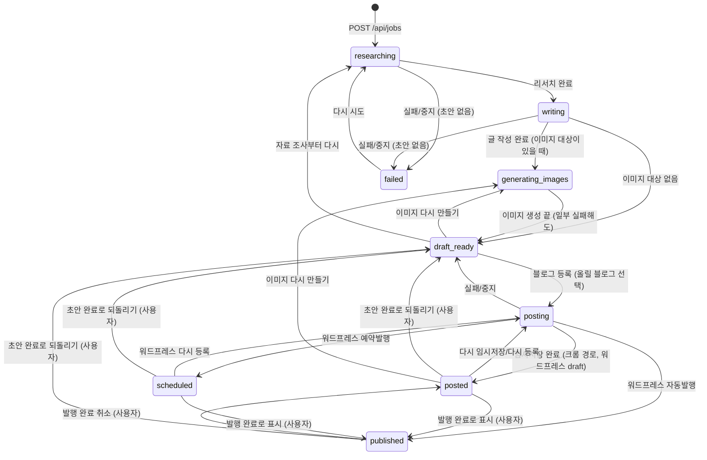

# Job (작업)

## 의미
주제 하나로 블로그 글 한 편을 만드는 단위. 화면 사이드바 "내 글"의 한 줄이다. 리서치 결과, 초안, 이미지, 진행 로그, 적용된 규칙 사본을 모두 담는다.

## 속성
| 속성 | 타입 | 의미 | 화면 표시 |
|---|---|---|---|
| `id` | uuid | 식별자, 파일 이름 | |
| `topic` | string | 사용자가 넣은 주제 (2~300자) | 제목이 생기기 전 목록 이름 |
| `links` | string[]? | 사용자가 준 참고 링크 (리서치에서 반드시 열어 봄) | |
| `status` | `JobStatus` | 진행 상태 9종 (아래) | 배지, 목록 상태 필터 |
| `imageOptions` | ImageOptions | 이 작업의 이미지 설정 → [[image/entities/ImageOptions]] | |
| `postingTo` | Platform? | 블로그에 올리는 중(`posting`)일 때 올리는 블로그. 같은 `posting` 상태의 라벨을 구분한다: 워드프레스는 "워드프레스 등록 중", 네이버·티스토리는 "크롬 작성 중" (`statusLabel`). 올리는 중이 아니면 의미 없음(값은 다음 등록 때 덮어씀) | 목록 배지, 상세 안내 문구 |
| `generatingImages`, `regeneratingImages` | string[]? | 지금 만드는 이미지 키(`thumbnail`/`body-<n>`)와 그중 이미 파일이 있던 것 | 이미지별 진행 표시 |
| `researchNotes` | string? | 리서치 노트 (사실마다 출처) | "리서치 노트" |
| `rulesSnapshot` | string? | 작업 시작 시점의 글쓰기 규칙 사본 | "이 글에 적용된 글쓰기 규칙" |
| `sources` | Source[] | 리서치에서 실제로 연 페이지 {title,url,kind(official/press/blog/other)} | "수집한 출처" |
| `post` | Post? | 초안 → [[writing/entities/Post]] | 미리보기/편집 |
| `logs` | {at,message}[] | 진행 로그 | "진행 로그", 진행 중 마지막 줄 |
| `error` | string? | 마지막 실패 메시지 | 빨간 배너 |
| `wordpress` | `WordPressRecord`? | 워드프레스 API로 올린 글 기록: `postId`, `link`, `mode`(draft/schedule/publish), `scheduledAt`, `mediaIds`(올린 이미지 파일명 → 사이트 미디어 {id,url}). 다시 등록하면 새 글 대신 이 글을 갱신한다 → [[publishing/overview]] | "글 열기" 링크, 예약 시각 |

## 상태와 전이

| 전이 | 조건 | 일어나는 곳 |
|---|---|---|
| → researching | 생성, 재시도(`markBusy`) | `blog-writer:server/store.ts:89-108`, `blog-writer:server/routes/jobs.ts:188-198`, `blog-writer:server/routes/util.ts:16-22` |
| researching → writing | `deepResearch` 성공 | `blog-writer:server/pipeline.ts:66-70` |
| → generating_images | 만들 이미지가 1개 이상 | `blog-writer:server/pipeline.ts:162-187` |
| → draft_ready | 초안 완성, 이미지 작업 끝(성공·실패·중지 모두), 블로그 등록 실패·중지(크롬·워드프레스), 재시작 복구(초안 있음) | `blog-writer:server/pipeline.ts:104-107`, `:146-156`, `:300-306`, `:360-366`, `blog-writer:server/store.ts:134-146` |
| → failed | 초안 없이 실패/중지, 재시작 복구(초안 없음) | `blog-writer:server/pipeline.ts:109-114`, `blog-writer:server/store.ts:139` |
| posting → posted | 크롬 세 경로 중 하나가 임시저장 완료 | `blog-writer:server/pipeline.ts:357-359` |
| posting → posted / scheduled / published | 워드프레스 API가 돌려준 글 상태(`draft`/`future`/`publish`)대로 정한다. 요청한 방식과 다르면 "확인 필요" 로그 | `blog-writer:server/pipeline.ts:276-310` |
| posted·scheduled → published | 사용자가 "발행 완료로 표시" (`PUT /api/jobs/:id/status`) | `blog-writer:server/routes/jobs.ts:147-177` |
| published → posted | "발행 완료 취소" | `blog-writer:server/routes/jobs.ts:147-177` |
| posted·scheduled·published → draft_ready | 사용자가 "초안 완료로 되돌리기"(확인 창). 블로그에 올린 글은 그대로 남는다 | `blog-writer:server/routes/jobs.ts:147-177`, `blog-writer:src/job/NextStep.tsx:6-8` |
| published → draft_ready | 이미지를 다시 만든 뒤 이미지 단계가 끝날 때(이미지 단계는 항상 draft_ready로 끝남). 의도된 동작 (2026-10-05 확정) | `blog-writer:server/pipeline.ts:146-149` |

수기 전이 표 `MANUAL_TRANSITIONS`: posted → published·draft_ready, published → posted·draft_ready, scheduled → published·draft_ready. 요청 본문 상태는 `draft_ready`·`posted`·`published`만 받는다 (`scheduled`로는 수기 변경 불가). 진행 중이면 409 (`blog-writer:server/routes/jobs.ts:157-177`). 테스트: `blog-writer:tests/api.test.ts:96-111`.

`published`(발행 완료)는 두 경우다: 사용자가 블로그에서 직접 발행한 글을 표시한 것, 또는 워드프레스 API의 자동발행 결과 → [[publishing/business-rules/BR-PUB-013 발행 완료 표시]]. `scheduled`(예약됨)는 워드프레스에 예약발행을 걸어 둔 상태로, 앱은 예약 시각이 지나도 상태를 자동으로 바꾸지 않는다 (사용자가 "발행 완료로 표시"). 진행 중 상태 묶음 `BUSY_STATUSES = researching, writing, generating_images, posting` (`blog-writer:shared/types.ts:245`) — 화면 폴링·버튼 비활성·재시작 복구 대상. 상태 이름은 화면과 서버 오류 문구가 같은 표 `STATUS_LABEL`(`blog-writer:shared/labels.ts:4-14`)을 쓴다.

## 저장 위치
`<데이터 폴더>/jobs/<id>.json` (데이터 폴더는 기본 `data/`, 환경 변수 `BLOG_WRITER_DATA_DIR`로 바꿀 수 있음). 쓰기는 id별 줄 세우기(`keyedQueue`) + 임시 파일 후 이름 바꾸기(`writeJsonAtomic`, `server/fsutil.ts`) → [[_system/data-storage]]

## 적용되는 규칙
[[writing/business-rules/BR-WRT-010 주제와 참고 링크 입력 검증]], [[writing/business-rules/BR-WRT-011 작업 중복 실행과 진행 중 변경 금지]], [[writing/business-rules/BR-WRT-012 중단 시 작업 상태 복구]], [[writing/business-rules/BR-WRT-009 글쓰기 규칙 적용 시점]]

## 변경 이력
| 날짜 | 변경 | 근거 |
|---|---|---|
| 2026-10-07 | 상태 `scheduled`(예약됨) 추가, 워드프레스 등록 결과로 posted/scheduled/published 결정, `wordpress` 기록 추가, 수기 전이에 scheduled → published·draft_ready 추가 | `blog-writer:shared/types.ts:218-272`, `blog-writer:server/pipeline.ts:276-310`, `blog-writer:server/routes/jobs.ts:147-151` |
| 2026-10-07 | `postingTo` 추가, 올리는 중 라벨이 블로그에 따라 "워드프레스 등록 중"/"크롬 작성 중"으로 갈림 (워드프레스는 크롬을 쓰지 않는데 "크롬 작성 중"으로 보이던 것을 고침) | `blog-writer:shared/labels.ts:4-18`, `blog-writer:server/routes/util.ts:16-23`, `blog-writer:server/pipeline.ts:284`, `:322` |
