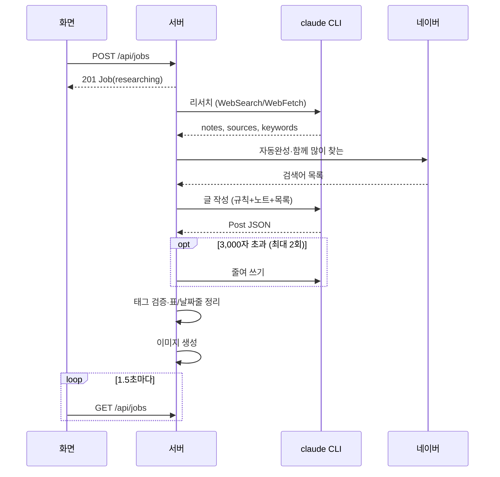

# 초안 작성 플로우

## 목적
주제 하나로 출처가 붙은 리서치 노트와, 규칙에 맞는 초안(제목·본문·태그·이미지)을 만든다. 보통 5~15분 (`blog-writer:src/NewJob.tsx:103`).

## 단계
| # | 단계 | 위치 | 관련 규칙 |
|---|---|---|---|
| 1 | 주제·참고 링크·이미지 옵션 입력, 주제 2자 이상이면 버튼 활성 | 화면 `NewJob` | [[writing/business-rules/BR-WRT-010 주제와 참고 링크 입력 검증]] |
| 2 | `POST /api/jobs` 검증, 이미지 옵션을 설정 기본값으로 저장, job 생성(`researching`), `runDraft` 시작, 201 | `blog-writer:server/routes/jobs.ts:43-72` | [[image/entities/ImageOptions]] |
| 3 | 화면이 목록을 새로 읽고 작업 상세로 이동, 1.5초 폴링 시작 | `App.tsx` | |
| 4 | 글쓰기 규칙 읽기 → `rulesSnapshot` 저장 → 로그 | `pipeline.ts` | [[writing/business-rules/BR-WRT-009 글쓰기 규칙 적용 시점]] |
| 5 | 딥서칭: Claude + WebSearch/WebFetch → 노트·출처·검색 질문·키워드. 상태 `writing` | `research.ts` | [[writing/business-rules/BR-WRT-014 리서치 출처 등급과 열람 제한]], [[writing/business-rules/BR-WRT-003 확인된 사실만 사용]] |
| 6 | 중지 확인 → 네이버 자동완성·함께 많이 찾는 수집 | `naver.ts` | [[writing/business-rules/BR-WRT-015 네이버 검색어 제안 수집 범위]] |
| 7 | 글 작성: Claude가 `POST_JSON_SCHEMA`로 초안 | `writer.ts writePost` | [[writing/business-rules/BR-WRT-013 제목 후보와 키워드]] |
| 8 | 분량 초과면 최대 2번 줄이기 | `writer.ts enforceLength` | [[writing/business-rules/BR-WRT-001 본문 분량 상한]] |
| 9 | 태그 정리·출처 검증·30개 자르기, 표 정리, 날짜줄 제거, 이미지 개수 맞추기 | `writer.ts` | [[writing/business-rules/BR-WRT-005 태그 출처 검증]], [[writing/business-rules/BR-WRT-004 태그 최대 30개]], [[writing/business-rules/BR-WRT-007 빈 칸 있는 표 행 제거]], [[writing/business-rules/BR-WRT-008 날짜 표시줄 제거]], [[image/business-rules/BR-IMG-001 본문 이미지 개수]] |
| 10 | `job.post` 저장, 로그 "글 작성 완료: 제목 (본문 N자)" | `pipeline.ts` | |
| 11 | 이미지 생성 (대상 있을 때) | `pipeline.ts makeImages` | [[image/flows/이미지 생성 플로우]] |
| 12 | 상태 `draft_ready`, 로그 "초안 완성" | `pipeline.ts` | |
| 13 | 화면: 진행 단계·"다음 할 일"(초안 검토 → 올릴 블로그 선택 → 임시저장/워드프레스 등록) | `src/job/Progress.tsx`, `src/job/NextStep.tsx` | [[publishing/flows/블로그 임시저장 플로우]] |

## 시퀀스

## 실패 / 예외 경로
| 상황 | 결과 | 사용자에게 보이는 것 |
|---|---|---|
| claude CLI 없음·오류·타임아웃 | 초안 없으면 failed | 오류 배너, "다시 시도" |
| 리서치 결과 스키마 불일치 (notes 빈 값 등) | zod 오류로 failed | 오류 배너 |
| 네이버 수집 실패 | 빈 목록으로 계속 | 로그 "0개" |
| 사용자 중지 | 초안 없으면 failed, 있으면 draft_ready | "작업을 중지했습니다." → [[writing/flows/작업 중지와 재시도 플로우]] |
| 서버 재시작 | 복구 시 failed/draft_ready | "서버가 재시작되어 작업이 중단되었습니다." |
| 이미지 일부 실패 | draft_ready (글은 성공) | 실패한 이미지 자리에 실패 이유, 이미지마다 "이미지 다시 생성" |

## 관련 엔티티
[[writing/entities/Job]], [[writing/entities/Post]], [[writing/entities/글쓰기 규칙]]
