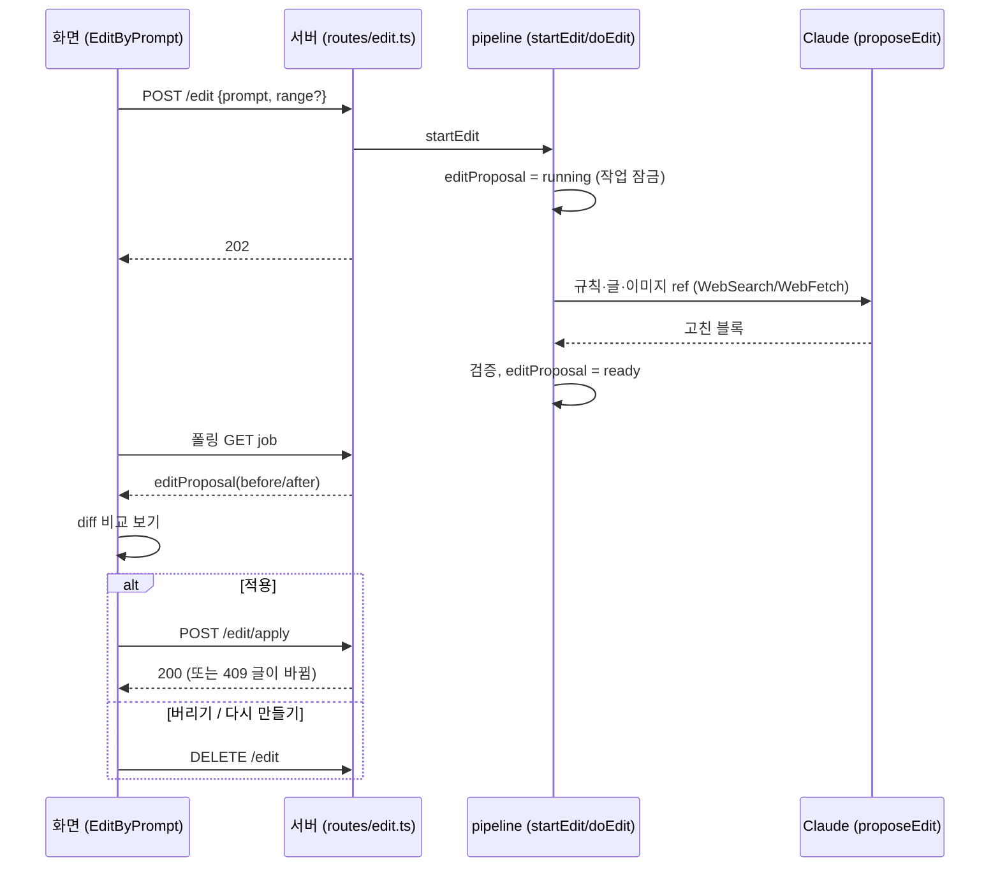
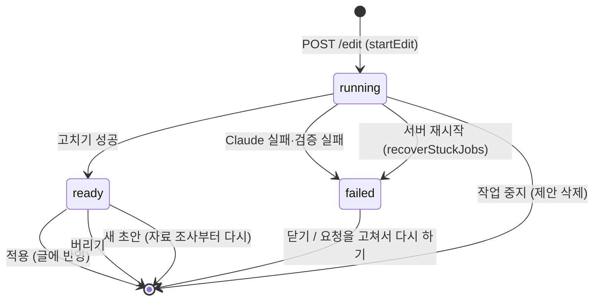

# 프롬프트로 글 고치기 플로우

## 목적
이미 만든 초안을 사용자의 말로 고치거나 내용을 더하되, 결과를 바로 넣지 않고 **바뀐 부분을 비교해 본 뒤** 적용할지 정하게 한다.

## 단계
| # | 단계 | 위치 | 관련 규칙 |
|---|---|---|---|
| 1 | 편집 탭에서 블록 앞 체크박스로 고칠 블록을 고른다(선택 없으면 글 전체). 카드에 수정 요청(2자 이상) 입력 | `PostEditor` `selection`, `EditByPrompt` | [[writing/business-rules/BR-WRT-016 프롬프트로 글 고치기]] |
| 2 | 시작 버튼: 먼저 편집 내용 저장(`flush`) 후 `POST /api/jobs/:id/edit {prompt, range?}`. 범위는 고른 블록의 최솟값~최댓값 | `JobDetail` | |
| 3 | 서버: 요청 검사(400), 진행 중이면 409, 아니면 202 | `routes/edit.ts` | [[writing/business-rules/BR-WRT-017 고친 결과 적용 조건과 잠금]] |
| 4 | `startEdit`: `editProposal = {status:"running"}`를 먼저 기록하고 작업을 `running`에 등록 → 글 수정·올리기·이미지 작업 잠금. 백그라운드에서 `doEdit` | `pipeline.ts` | BR-WRT-017 |
| 5 | `proposeEdit`: 글쓰기 규칙 + 고치는 방법 프롬프트, 이미지는 ref로, WebSearch·WebFetch 허용. 진행은 로그("웹 검색: …", "페이지 읽는 중: …")로 보임 | `editPost.ts` | [[writing/business-rules/BR-WRT-018 고칠 때 이미지는 그대로]] |
| 6 | 결과 검증: 이미지 되돌려 붙이기·빈 표 제거·바뀐 것 없음 거절. 성공이면 `ready`(before/after/note/글자 수), 실패면 `failed`+error | `editPost.ts`, `doEdit` | BR-WRT-018 |
| 7 | 화면(1.5초 폴링): 바뀐 블록만 비교(`diffBlocks`/`collapseSame`: 추가 초록, 삭제 취소선, 같은 블록은 앞뒤 하나씩만 두고 접음), 제목·요약 변경, 본문 글자 수 변화, 3,000자 초과 경고 | `EditByPrompt`, `shared/blockDiff.ts` | [[writing/business-rules/BR-WRT-001 본문 분량 상한]] |
| 8 | 적용: `POST /edit/apply` → 범위의 현재 블록이 `before`와 같을 때만 반영, 제안 삭제, 로그 | `routes/edit.ts`, `applyProposal` | BR-WRT-017 |
| 9 | 버리기: `DELETE /edit`. "요청을 고쳐서 다시 만들기": 요청 글을 입력칸에 채우고 제안을 버림 → 사용자가 고쳐 다시 1~2단계 | `EditByPrompt` | |

## 시퀀스

## 제안 상태

## 실패 / 예외 경로
| 상황 | 결과 | 사용자에게 보이는 것 |
|---|---|---|
| 초안 없음·요청 짧음·범위 오류 | 400 | 오류 문구 |
| 다른 작업 진행 중 | 409 | "진행 중인 작업이 끝난 뒤에 시작해 주세요." (카드 입력은 `busy`면 비활성) |
| Claude 실패, 이미지 개수 불일치, 바뀐 것 없음 | `failed`, 글은 그대로 | 카드의 빨간 오류 + "요청을 고쳐서 다시 하기"/"닫기" |
| 중지 | 제안 삭제 | 로그 "글 고치기를 중지했습니다." |
| 서버 재시작 | `failed` | "서버가 재시작되어 글 고치기가 중단되었습니다." |
| 그 사이 글이 바뀌어 적용 불가 | 409, 제안은 남음 | "그 사이 글이 바뀌어서 적용할 수 없습니다. 같은 요청으로 다시 만들어 주세요." |
| 블록 수 변화(이미지 추가·삭제, 적용) | 선택 해제 | 체크박스가 비워짐 |

## 관련 엔티티
[[writing/entities/Job]], [[writing/entities/Post]]

## 변경 이력
| 날짜 | 변경 | 근거 |
|---|---|---|
| 2026-10-09 | 최초 기록 | 커밋 b7ced30 |
